#### 什么叫数据可视化

* 例子1

-数据可视化释义(屈华民)/image-20200706122906696.png)

>  输入：数据；输出：视觉形式；目标：知识；

* 例子2

  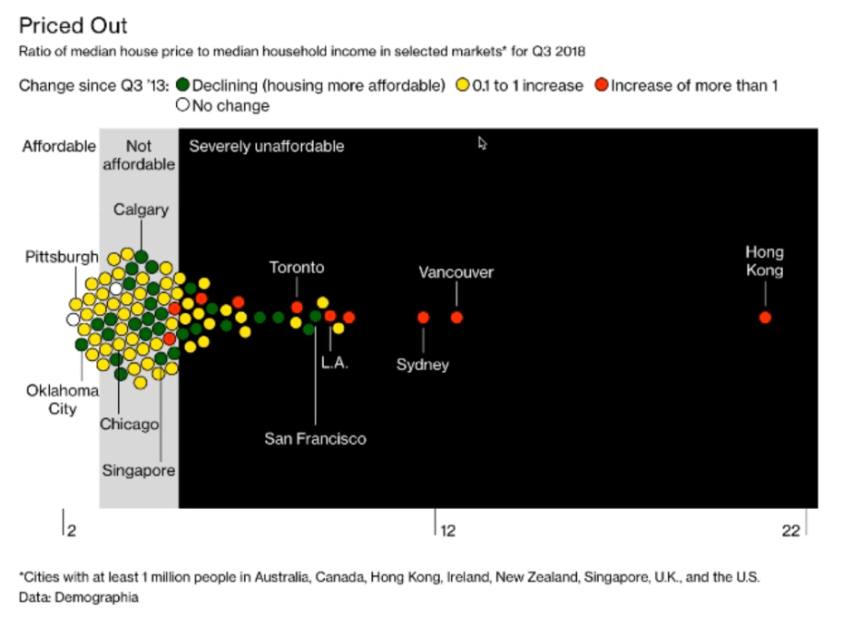

* 例子3 

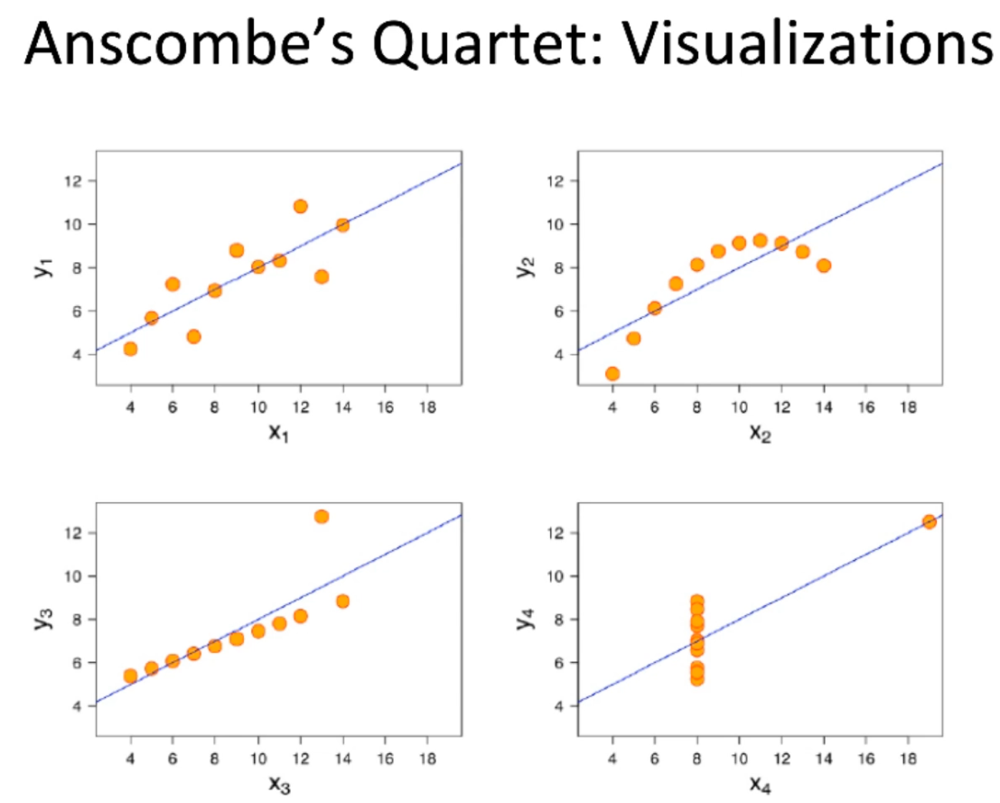

#### 读图力

* 初级（基础图表）

  > IQ 智商-左脑-数学物理
  >
  > VQ 视商-右脑

  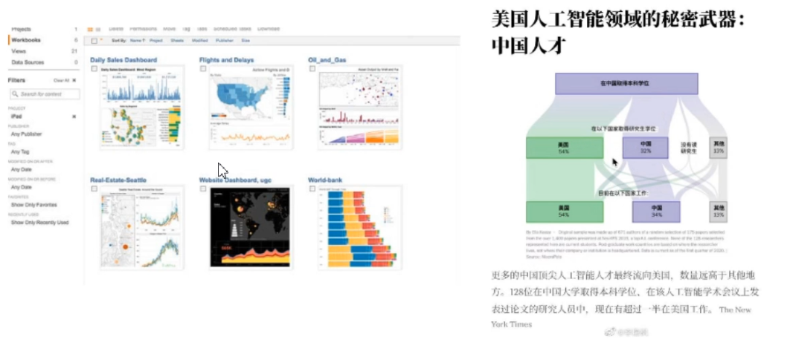

* 中级

  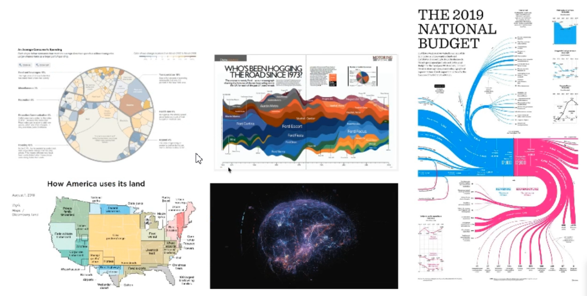

* 高级 （系统/多图联动）

  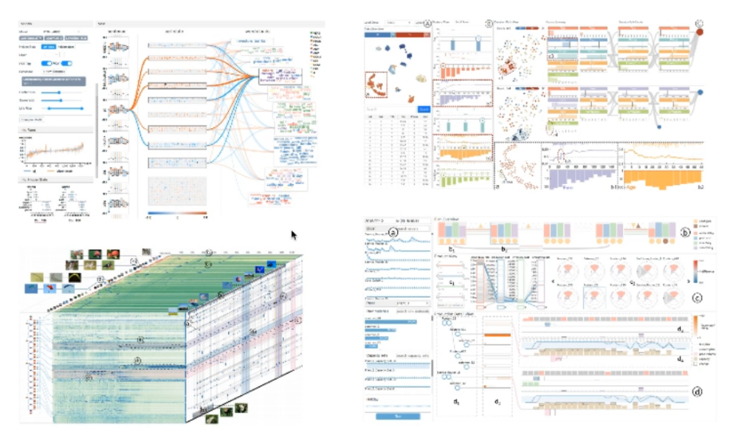-数据可视化释义(屈华民)/image-20200706125305203.png)

#### 数据可视化的魅力

* 例子1 （https://youtu.be/jbkSRLYSojo）

   从1876年到2009年各个国家寿命和收入的分布变化情况

* 例子2 （https://www.youtube.com/watch?v=QPKKQnijnsM）

  美国财富分配情况：预期理想与实际

#### 数据可视化简史

* 早期可视化例子：静态信息图（伦敦霍乱与取水地的关系）

  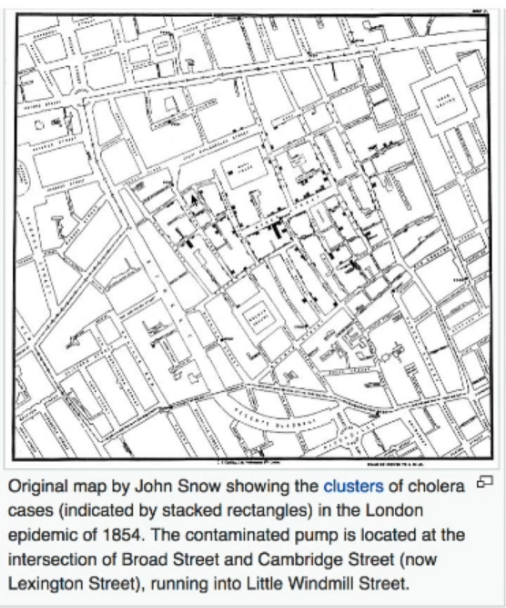

> 可视化帮助形成假设——当你有一个问题，这个问题与数据有关系，而这个情况下你并没有清晰地搜索方向，可视化帮助你形成假设，对这个问题有更好的理解，然后用别的工具和方法可以验证这个假设

* 现阶段可视化-可交互

> * 科学可视化：针对空间数据，数据本身带XYZ坐标和几何形状，应用：医学
> * 信息可视化：针对抽象数据，数据本身不带XYZ坐标和几何形状
> * 可视分析VAST：针对超大规模数据分析，结合机器学习和AI，

* 可视化的兴起：大数据和机器学习的兴起

> * 奥巴马的大数据计划
> * 开放数据集

> 可视化：大数据的最后一公里

**大数据的流程**

* 

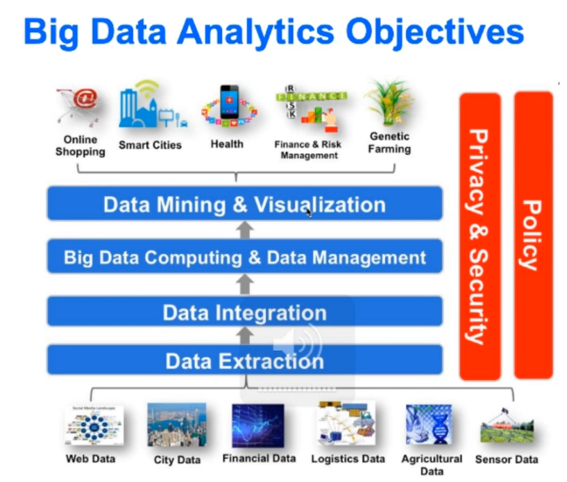

* 可解释性AI

  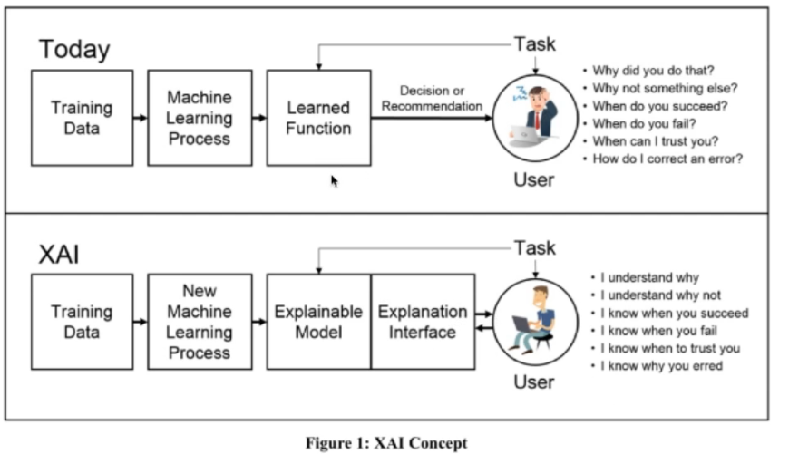

#### 可视化的跨界与融合

* +可视化：Cognitive Science/ Computer Graphics/ Human-Computer Interaction/ Machine learning/ Graphical Design/ Visual Communication
* 可视化+：Urban Infomatics/ Medical imaging/ Computational fluid dynamics/ Social media/ Social science

#### 可视化的标准 （什么叫好的可视化）

* **信：**准确 

> * **撒谎因子概念**
>
> ​	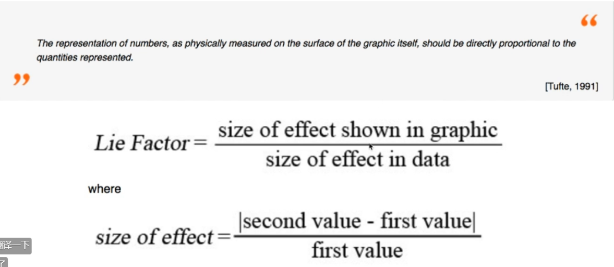
>
> * **effectiveness principle?**
>
> ​	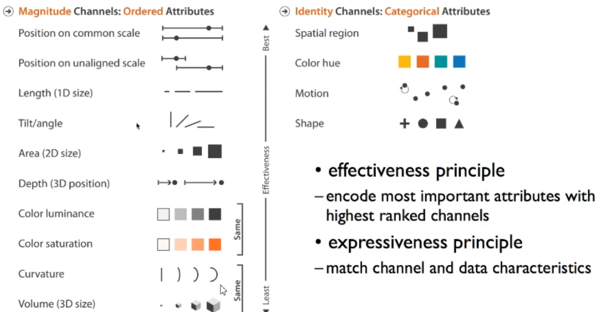

* **达：**直观、高效、有效

> * 涉及可视化的评估（用户评估、专家评估等）

* **雅：**艺术性

> * 《数据可视化之美》

#### 数据可视化的分析流程

* 早期数据可视化：解决的数据量不够大

  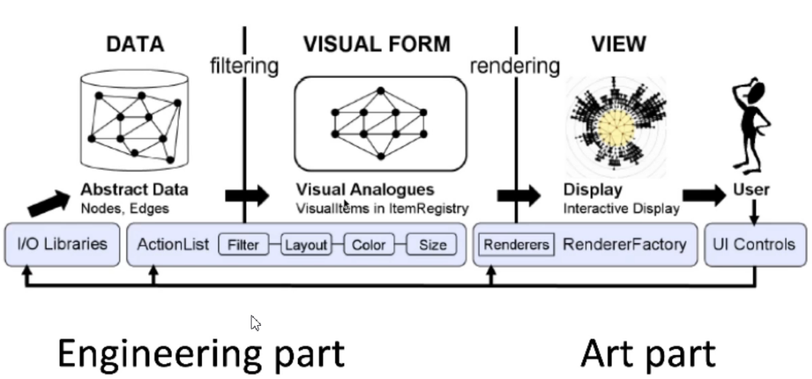-数据可视化释义(屈华民)/image-20200706145214878.png)

* 可视分析：可视化与机器学习结合

  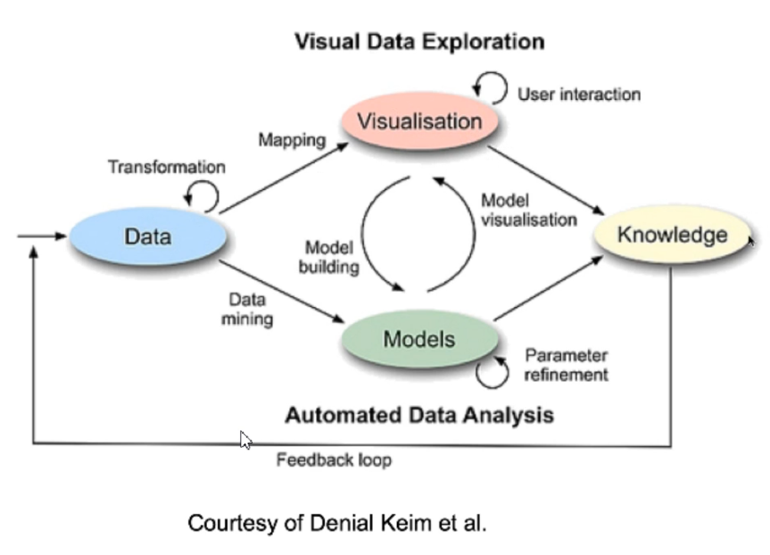

#### 可视化与相关领域的关系

* **可视化与信息图**
* 信息图：静态
  
  * 可视化：可交互的
  
    

* **可视化与人机交互**
* VIS：处理数据
  
  * HCI：处理所有包括人和计算机的交互

> 因为可视化是有交互的，所以二者有交叉

* **可视化与机器学习/AI**

  让计算机做计算机擅长的、让人做人擅长的，但能用计算机解决的问题就不麻烦人
  
  > 机器学习：偏自动，把人排除在外
  >
  > 可视化：keep human in the loop，人可以发现一些pattern、自动算法算不出来、变量难以设置时，可视分析就很有作用
  >
  > （计算机图形+人机交互+数据挖掘 = 可视分析）
  
  
  
  > 大数据解决方法：有山有水（硬核的算法+可视化
  >
  > ​	好的解决方法：AI+HI（人工智能+可视化）
  >
  > 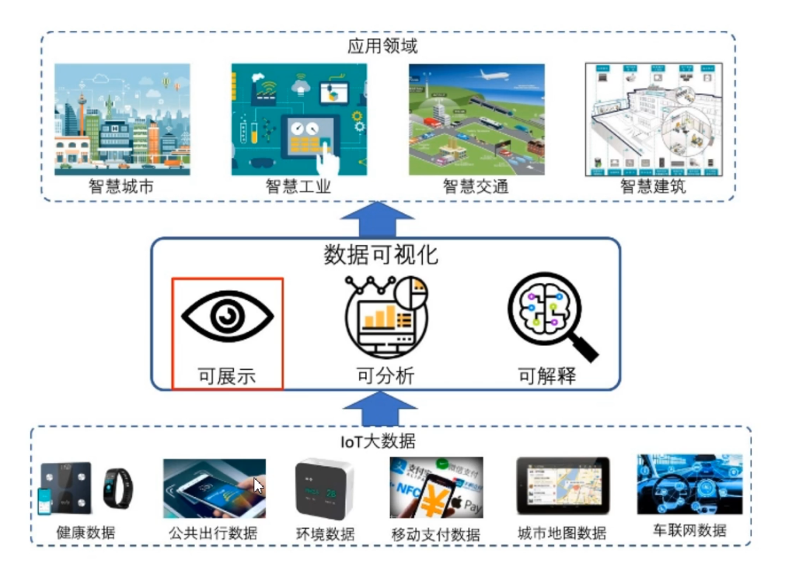

#### 国内可视化推荐：

	* 浙大实验室
	* 北大袁晓如
	* 同济曹楠
	* 清华刘世霞
	* 阿里dataV

#### 可视化的机会：

	- 普适的数据可视分析系统
	- 垂直领域的可视分析系统
	- 大屏展示系统
	- 数据动画
	- 5G时代：VR+VIS
	- 电子教育

