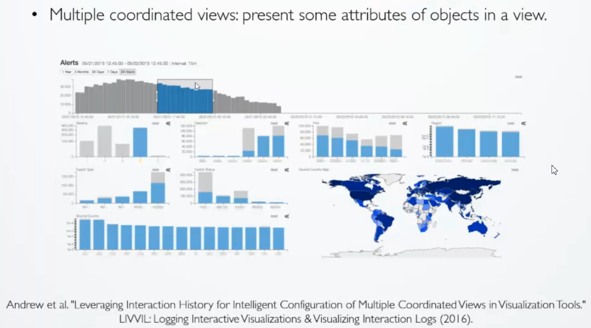
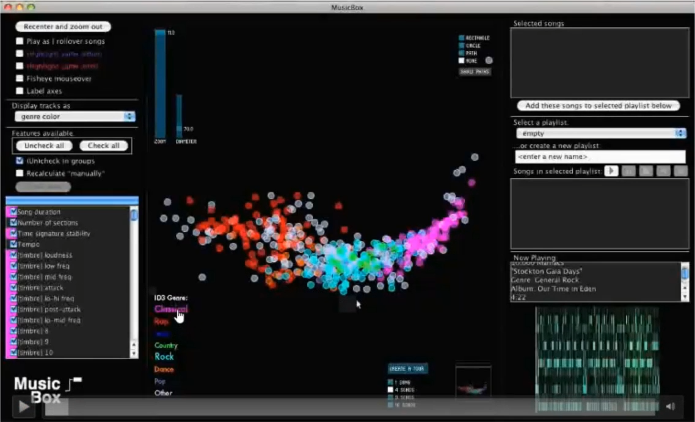
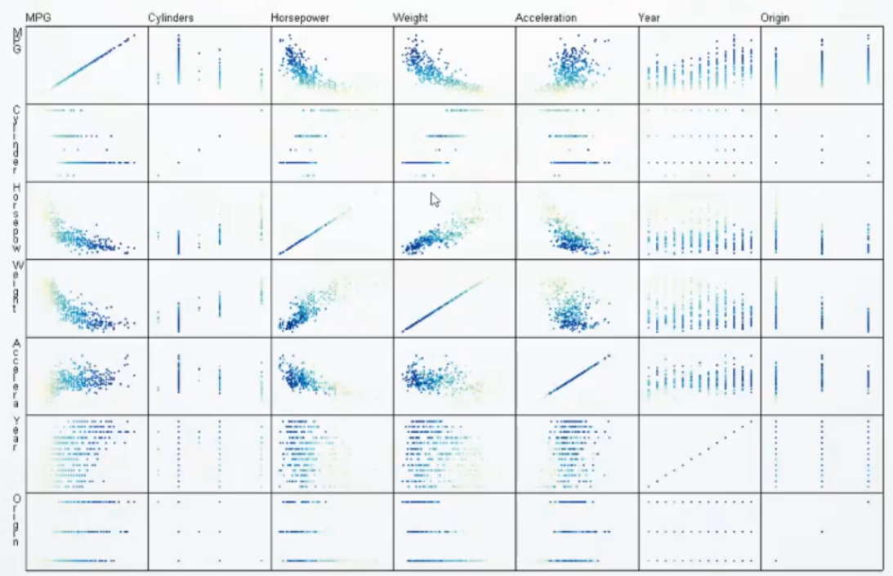
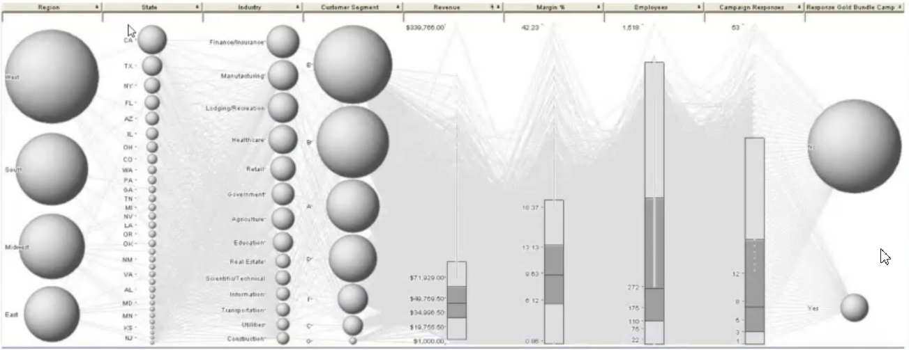
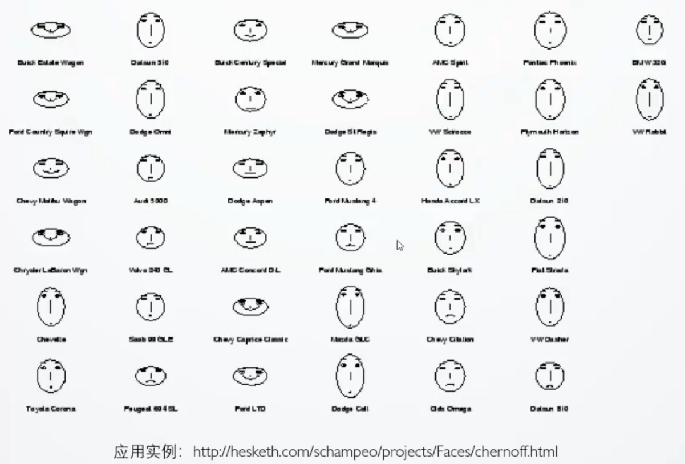
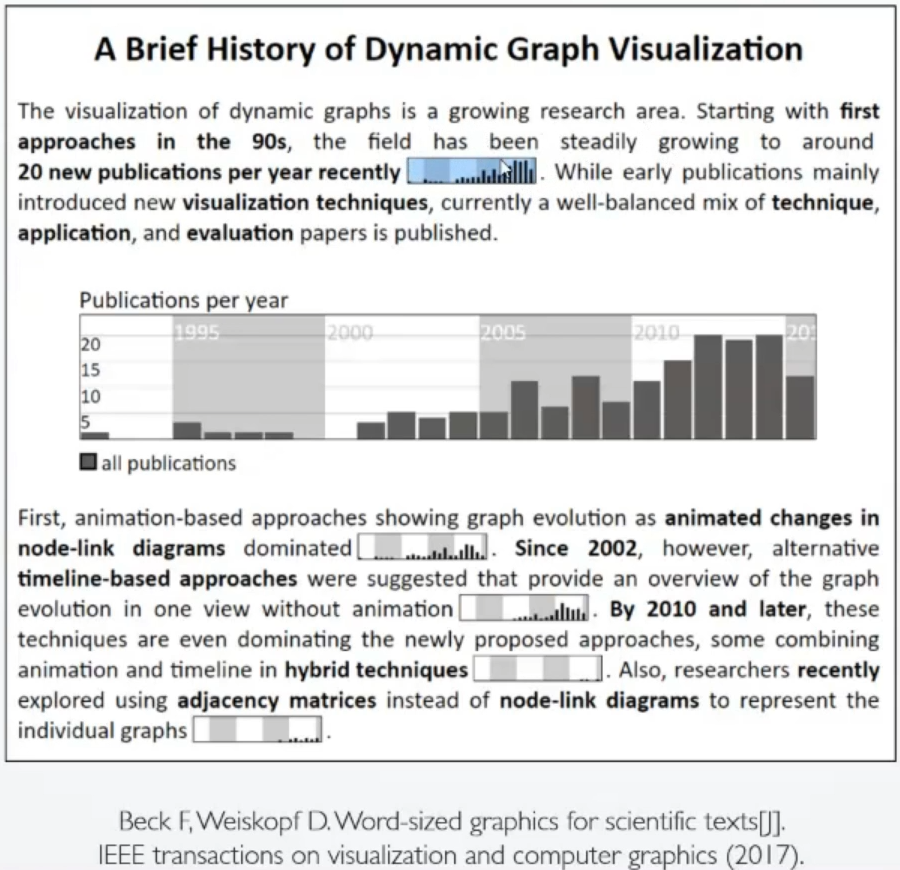
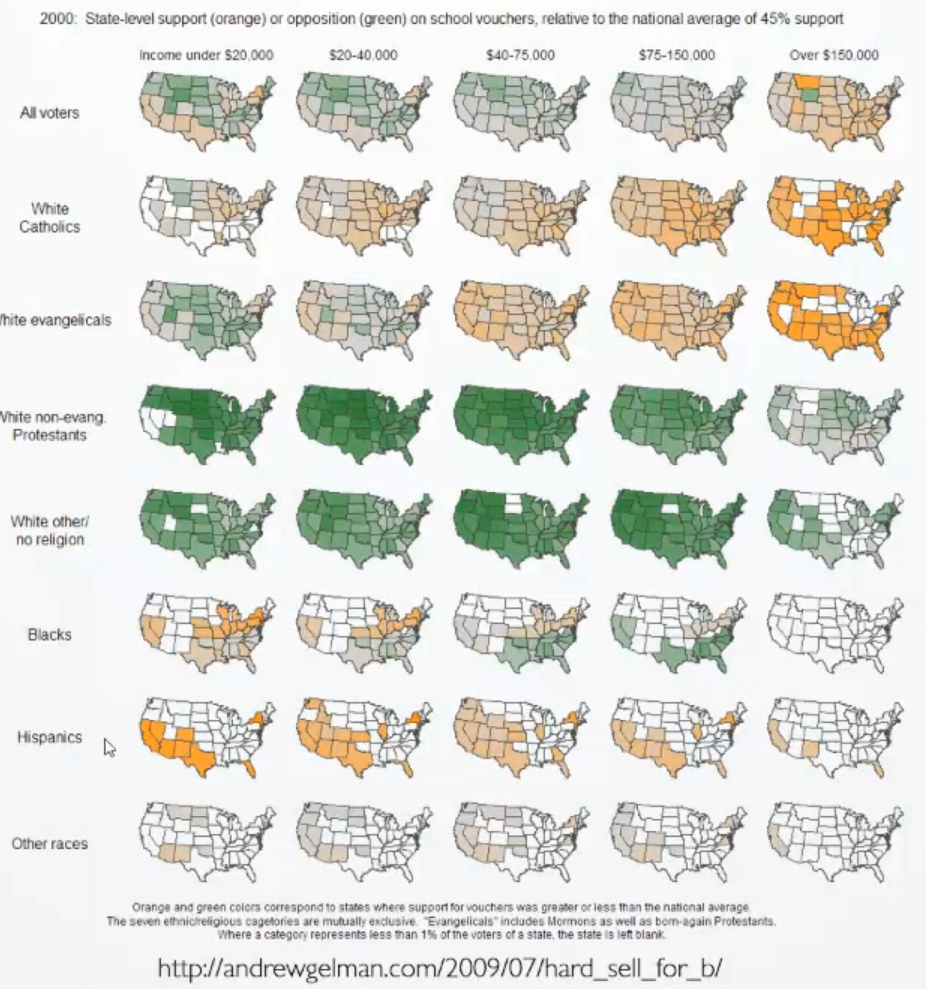
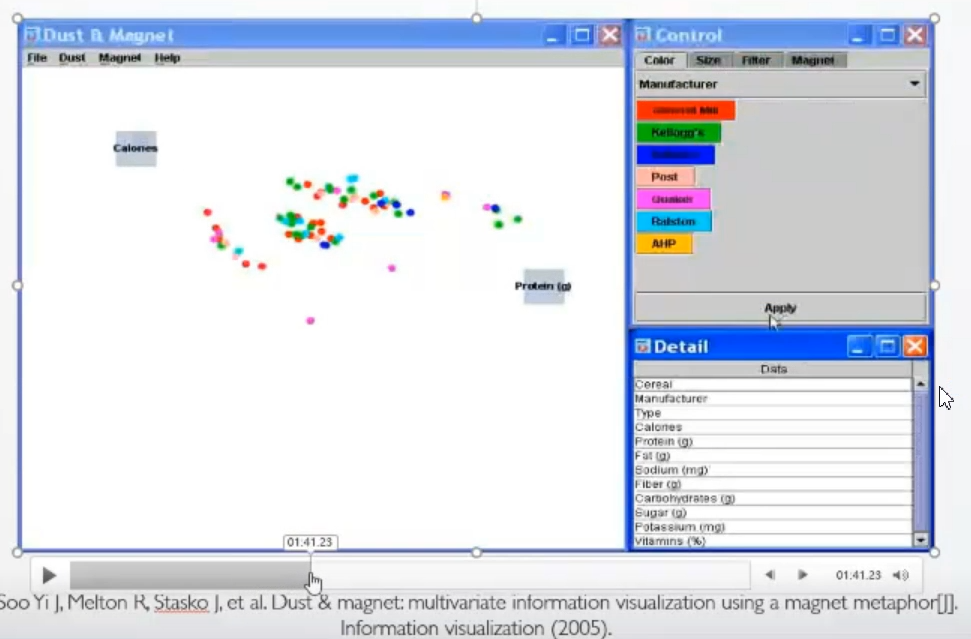

**课程：** 高维数据可视化
**讲师：** 巫英才
**讲师简介：** 浙江大学计算机科学与技术学院CAD&CG国家重点实验室百人计划研究员、博士生导师，目前担任浙江大学计算机科学与技术学院院长助理和CAD&CG国家重点实验室主任助理，并担任中国图象图形学学会人机交互专委会副主任。主要研究方向是信息可视化、可视分析和人机交互，聚焦于城市大数据、体育大数据和社交媒体大数据的可视分析研究。
**课程简介：** 本次课程主要介绍高维数据及其可视化方法，

**课程大纲：**

* Data Dimension
  * 1-D
  * 2-D
  * 3-D
  * High Dimension
* High-Dimensional Data Visualization
  * Dimensionality Reduction
  * Scatter-plot Matrix
  * Parallel Coordinates
  * Glyph-based Methods
  * 'Small Multiples'
  * Interaction: 'Dust & Magnet'

#### 1 数据维度
##### 数据的维度

> 指数据的属性，也叫字段。

- **一维数据**：对于只有一个属性的数据集使用直方图、折线图、饼图等基础图表即可简单呈现；

- **二维数据**：针对二维数据常采用二维空间散点图来表示，将各个属性值映射到不同的坐标轴，并确定个数据点在坐标轴中的位置；

- **三维数据**：可使用三维空间的散点图来可视化，但该方法读图效率低，给用户带来的误差较大。这是由于两个方面的原因，(1) 三维空间造成不同视角的数据分布模式不同；(2) 数据遮挡问题。因此，我们在进行三维数据的可视化时应该避免使用三维空间的散点图，不对抽象数据使用三维可视化，除非数据本身具有空间属性；

- **高维多元数据**：指每个数据对象有两个或两个以上独立或相关属性的数据。针对高维数据可视化的简单方法包括：
  **（1）增加视觉通道**：比如散点图增加颜色/形状/大小/颜色填充方式通道，但要注意根据数据类别和数据的分布范围选择合适的视觉通道，且该方法仅能支持若干属性，不适应超高维数据，注意视觉通道之间可能产生干扰，需要做一个权衡；

  **（2）多视图协调关联方法**：增加视图的方式，协调关联指视图与视图之间非独立，首先是相同数据集，在交互上也有关联，从不同侧面观察数据。问题在于，太多视图会造成视觉混淆，降低分析效率，视图选择要慎重。

  

  #### 2 高维数据可视化方法

除了以上提到的简单的高维数据可视化方法，为了支持更高维的数据，我们引出其他更高级的高位数据可视化方法，可以分为以下三类：

- 数据变化：
  - 数据降维（Dimensional Reduction）
- 数据呈现：
  - 散点图矩阵（Scatter-plot Matrix）
  - 平行坐标图（Parallel Coordinates）
  - 基于图标的方法（Glyph-based Methods）
  - 简化的多视图关联方法（'Small Multiples'）
- 数据交互：
  - dust + magnet

##### **数据降维：**

> 使用线性或非线性变换将高维数据投影到低维空间，并保持数据在高维空间中的特征的策略叫降维。

代表性数据降维方法：

- **线性：**
  - 主成分分析（Principal Component Analysis，PCA）
  - MDS（Multidimensional Scaling，MDS）
- **非线性：**
  - ISOMAP
  - 局部线性嵌入（Locally Linear Embedding，LLE）

**主成分分析（PCA）：**

- **动机1：**二维变一维，减去均值，投影到所选方向的直线上。怎样选择投影方向：(1) 信息丢失最少；(2) 投影值尽可能分散，即投影后数据方差最大。
- **动机2：**针对三维变二维，首先选择第一个方向，使投影后数据方差最大；然后选择第二个方向，如果按方差最大的方法，那么两个方向可能重合，即两个方向不是相互独立的。因此，可以继续两个方向的协方差，协方差为0表示两个方向相互独立，即第二个投影方向与第一个正交。
- **总结：**PCA的两个关键约束约束条件，一是最大化方差，二是最小化投影方向协方差，其核心步骤是特征分解协方差矩阵。
- **存在的问题：**不直观，没有实际的物理意义，给数据分析造成比较大的理解和优化障碍。

**多尺度投影（MDS）：**MDS方法比PCA适用性更广，因为其输入简单，只需原始数据集维度之间的相似度，不需要原始数据值，数据安全性和隐私性更高。如图所示为一个音乐可视化软件（MusicBox）的例子，将每首歌降维投影到二维平面，如果两个点相互靠的较近，则表明这两首音乐较相似。

##### **散点图矩阵**

* **散点图矩阵**：散点图矩阵是散点图的扩展。对于N维的数据，采用N的2次方个散点图逐一表示N个属性之间的两两关系，这些散点图根据它们所表示的属性，沿横轴和纵轴按一定的顺序排列，从而组成一个N*N的矩阵，典型的散点图矩阵示例如图所示。

- **散点图矩阵的变种**：可以替换对角线使用直方图表示对应属性分布。
- **存在的问题**：当维度较多时，散点图矩阵数量呈几何级数增长，难以发现其中规律或模式。有限展示重要性较高的散点图可以在一定程度上环节空间局限，目前已经有研究致力于自动化识别有价值的散点图，比如分类模式、相关模式，将其对应高亮展示。

##### **平行坐标轴：**

- **平行坐标轴：**采用相互平行的坐标轴，每个坐标轴对应一个数据属性。每个数据对象对应一条穿过所有坐标轴的折线。

- **平行坐标轴的变种：**球的大小表示类别数量，数据在整条轴上的分布。

- **交互：**选择、刷选、过滤等。

- **存在的问题：**当数据对象过多时，所有折线将相互遮挡造成视觉混淆，可以适当增加折线透明度以便查看数据分布趋势。

  

##### **图标法：**

- 图标法：采用图标来表示单个数据对象，使用不同的视觉元素来表示不同的属性。
- 常见的方法：
  - 雷达图（star plots），平行坐标的极坐标版本；
  - Chernoff Faces，使用模拟人脸的图标来表示数据对象，使用人脸的不同部位来编码不同的属性，示例如图所示；
  - 将图表嵌入文本的方式。

##### **多视图关联简化版（small multiples）**：小图表法，将一系列相似的小图表同时展示以便比较。

##### **交互方法：**

交互查看高维数据的方法之一是“Dust & Magnet"，源于2005年的一篇信息可视化论文，如图所示，使用灰尘隐喻数据点，磁铁隐喻数据属性过滤器，通过拖拽的方式将与磁铁对应属性相关的数据点吸引过来，交互查看数据在各个属性上的分布情况。

