### Geographic visualization

#### 1 地理数据

##### **地理数据**

- 位置信息
- 点位置衍生出来的距离、面积、坡度等信息

##### **地理数据结构**

- 位置属性
- 空间属性
- 时间属性

##### **地理数据表示方式**

* **基于向量：**点、线、面，方便计算

  例：出租车轨迹数据

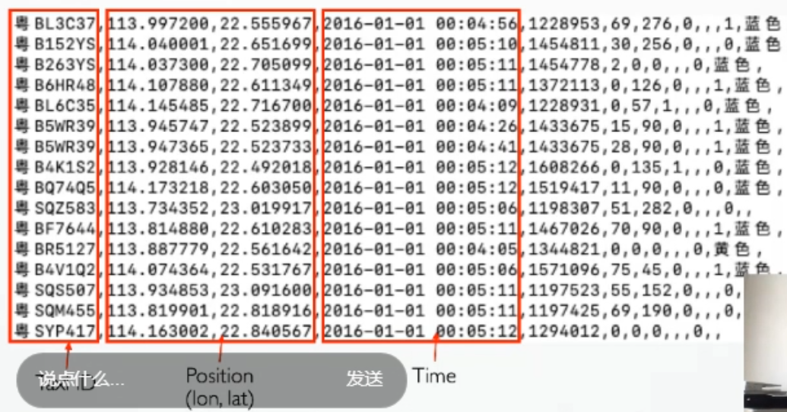

* **Raster Data**：把空间划分成网格，每个网格记录一个数值的大小，易于存储

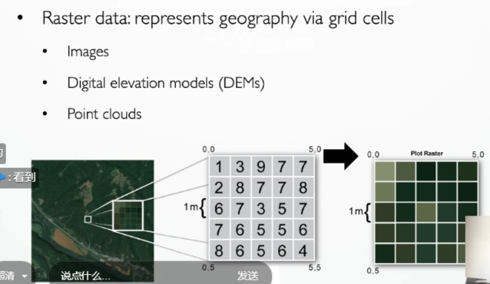

##### **地理分析的常见问题：**

* Identification - what
* Location - where
* Optimal path - shortest route
* Pattern - relations exists between
* models - what if
* Trends

> 运动数据的分析集中于空间S 、时间T以及属性A

#### 2 地图投影

> 把弯曲面的空间模式投影到平面的方法，把角度信息（经纬度）转化成坐标信息

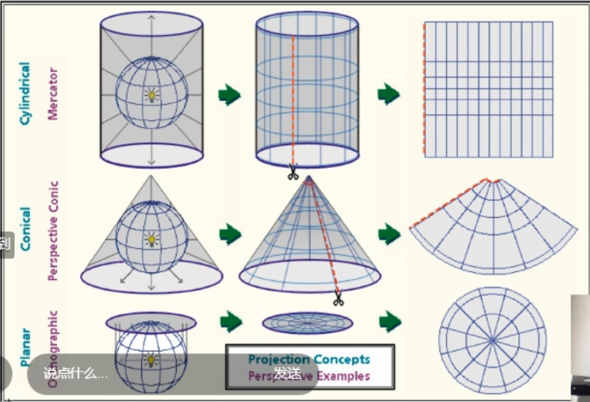

**墨卡托投影：**特点是保留相对位置信息，用于导航，缺点是面积变形，越往两极面积越大

**UTM：**适合局部城市的分析

> 对于地图投影，我们有四种性能评价维度，分别是共形、等面积、等距离和同方位角，但目前没有一种投影方法可以满足这四种要求，所以在实际应用中要根据需求进行取舍。

#### 地理数据可视化方法

- ​	Geometry-based
  - ​	Point
  - ​	Circles
  - ​	Lines
- ​	Choropleth
  - ​	数据分类
- ​	Cartograms
  - ​	Area cartograms
  - ​	Distance cartograms
- ​	Fields / Lines
  - ​	Density fields
  - ​	Lines

##### Geometry-based （几何形状）

* 基于点的地理数据：最常见的可视化方法是将点overlay到地图

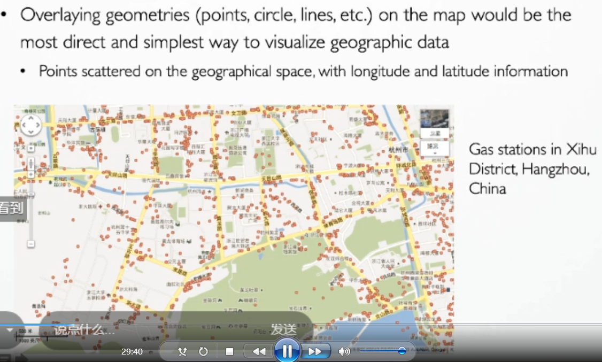

* encode nominal attributes with hues：

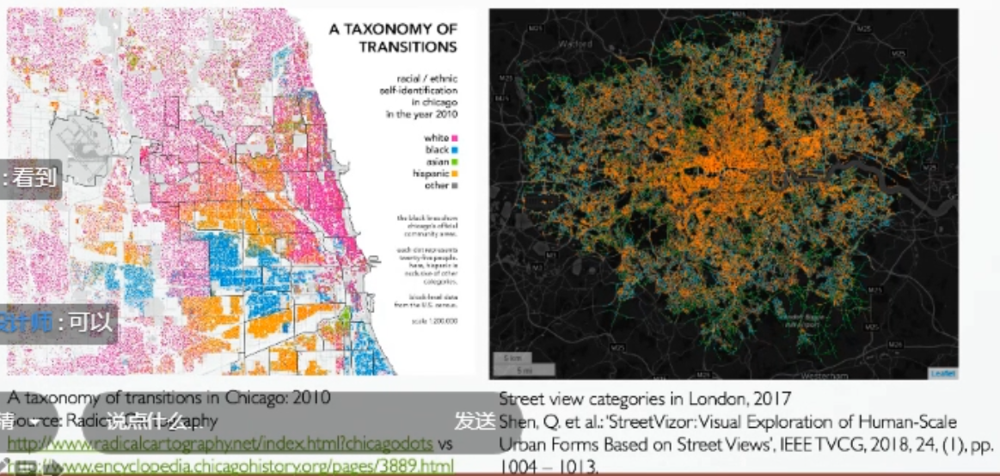

* encode quantitative attributes with circle size：

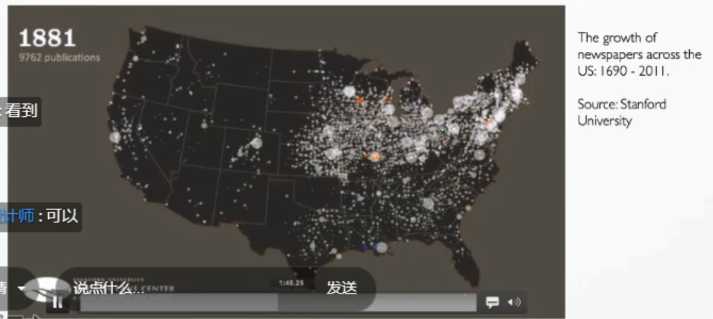

* nominal-orientation、quantitative-length：

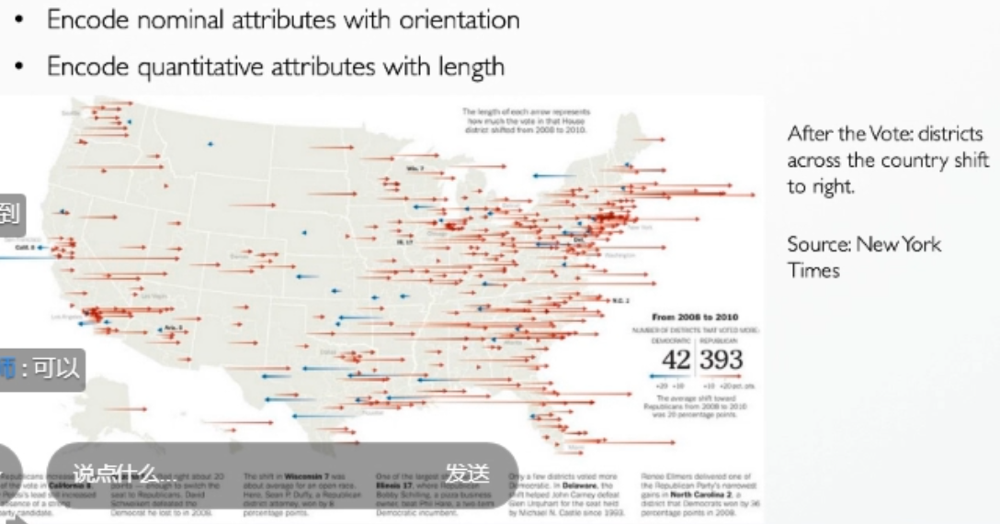

* 高维属性 - chernoff faces

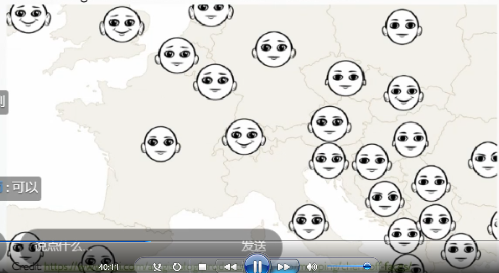

##### choropleth（分级统计图）

> 针对面积、数值变量

**适用场景：**

- 有明确边界

- 不适用于连续的现象

- 定义好的单元

- 数据可以做比率

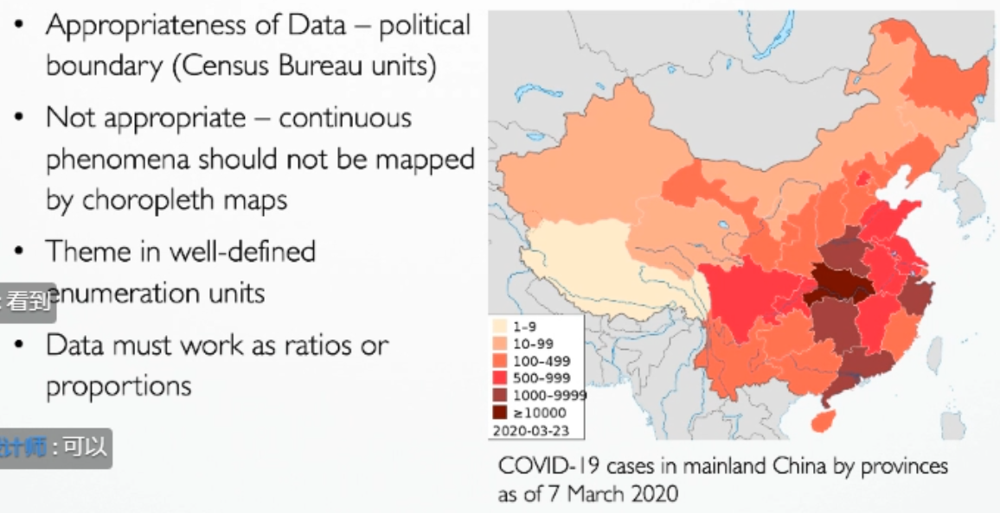

**数据分类：**5-7个比较合适，不能太多

**决定数据的划分范围：**

* Equal intervals
* Standard deviation
* Arithmetic progression
* Geometric progression
* Quantile
* Natural breaks
* Optimal

​	

##### Cartograms （比较统计图）

> 用土地面积或距离编码变量的地图; 
>
> 比如：表示旅行时间、人口数量、GNP
>
> 存在变形问题

* **area cartogram:**

* **distance cartogram:**

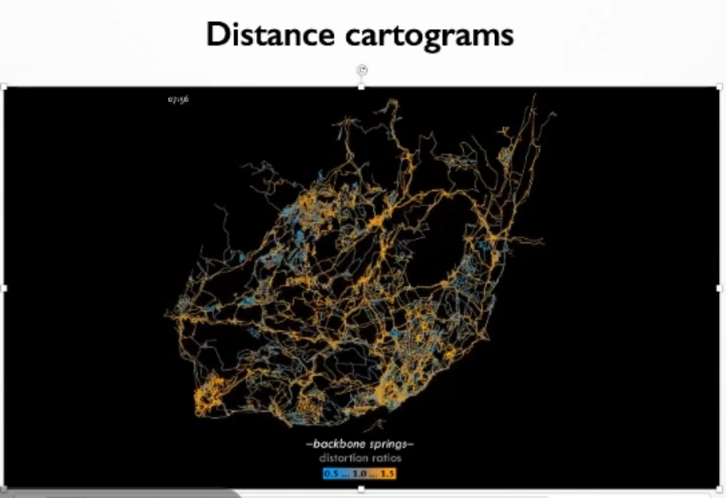

##### fields/lines （场 / 线）：

> 适用于事件序列属性，连续变化

**desity field(密度场)：**计算数据分布的density，然后将density值映射到颜色。空间上的密度分布，但仍不包含顺序信息。

* 密度计算方法：KDE-Kernel Density Estimation

​	例：

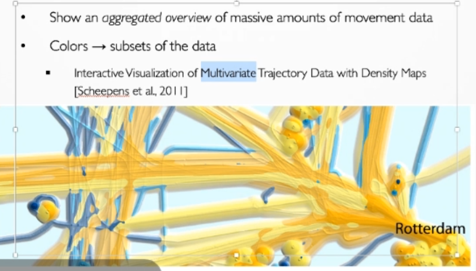

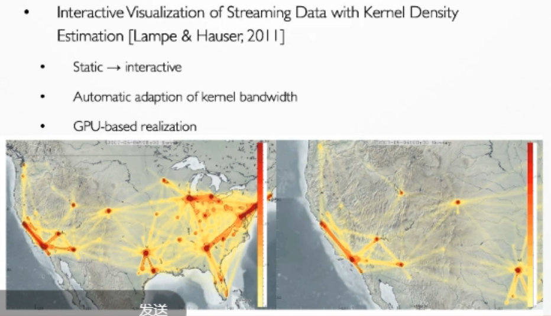

**direct lines：**只知道相邻区域的流动，无法表达后续流动

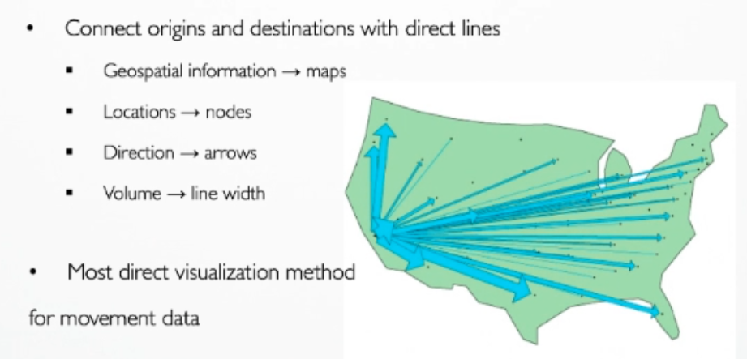

**Spatial generalization：**空间划分，用尽量少的线展示出区域与区域之间的轨迹

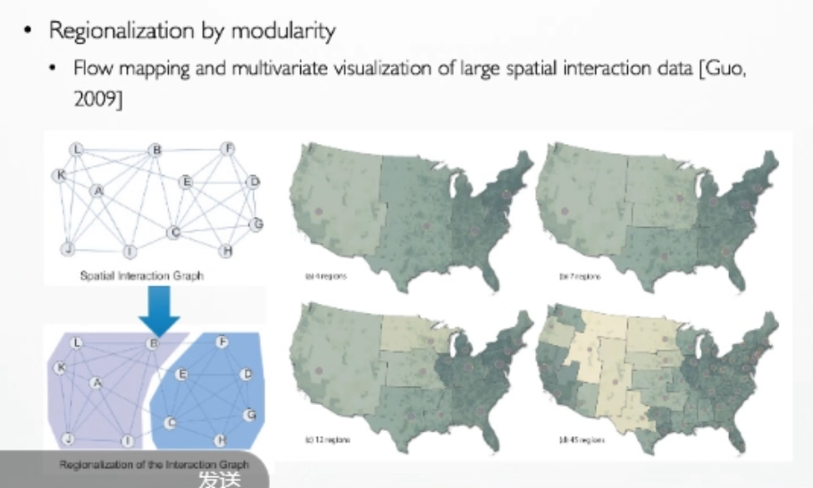

**Interchange Circos Diagram：**解决direct lines的劣势

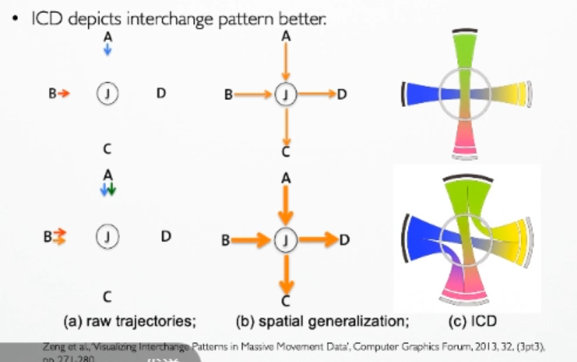

**Flow Map：**展示流向

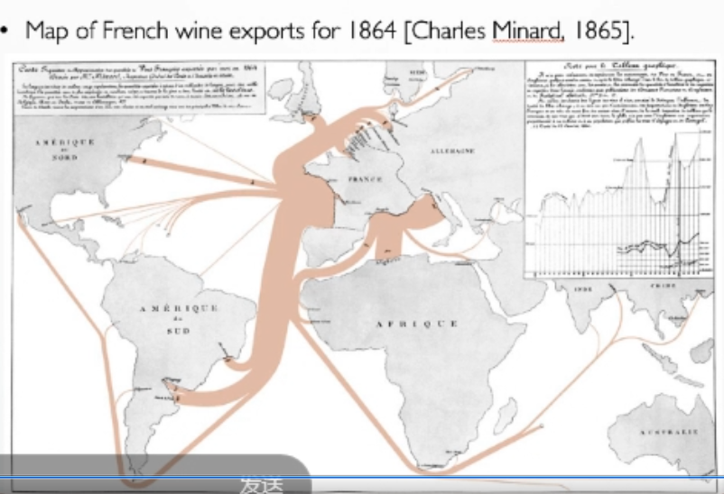

**自动Flow Map算法：**

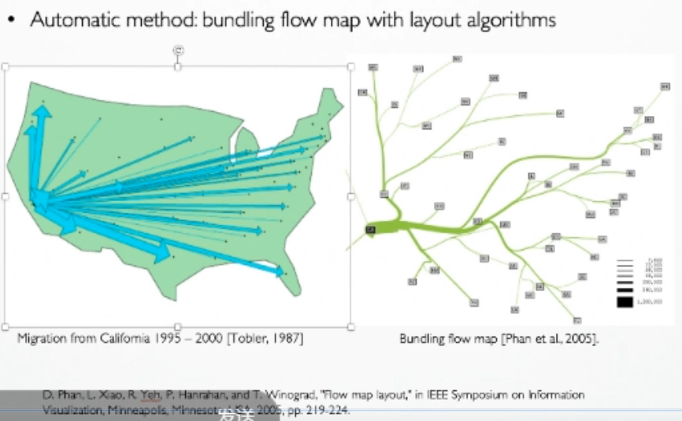

##### Edge bunding 边捆绑：

>  当数据存在大量节点和边时，视觉混乱（Visual Clutter）很快成为严重的问题。因此，学术界诸多研究者设计了各种通过优化边的方式减轻上述视觉混乱，其中边绑定（Edge Bundling）方法被广泛研究和应用。
>  其中，在城市交通OD数据的边绑定中，一种称为路由感知边捆绑（RAEB）的方法保留了路网的拓扑信息。

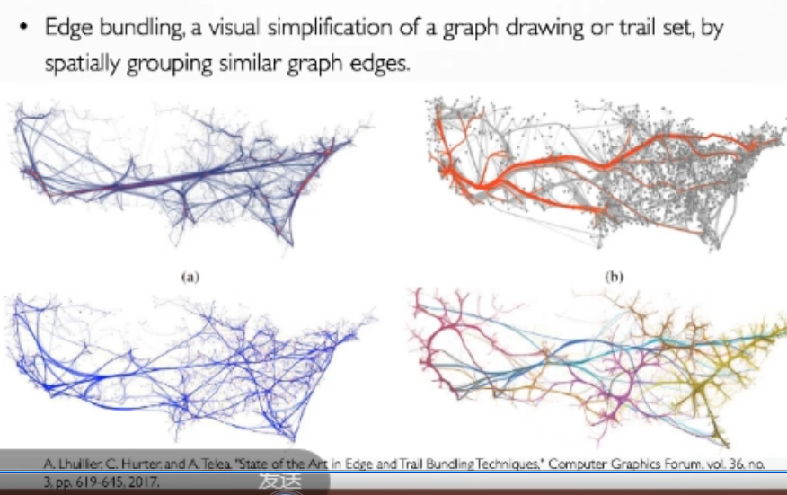

- KDE Edge bunding 方法
- Route-aware edge bunding（RAEB）方法

