图 Graph：边、节点、边和节点的属性、变的权重、边的方向

目的：探索和分析、呈现

#### 1 树可视化

##### 1.1 层次数据

树可以被认为是一种特殊的图。树的数据结构一般都是层次数据（Hierarchical Data），层次数据包括：

- 社交关系（social affiliations）
- 信息组织结构（information organization）
  - 文件目录
  - 物种发展
- 逻辑连接关系（logical connections）
  - 决策树

##### 1.2 层次数据可视化方法

###### 1.2.1 节点链接法**（node-link diagram）**

* 正交布局（orthogonal layout）（空间比率差）

  * 缩进法（indent diagram）：易于实现、缺少上下文信息，冗长

  * 系统树图（Dendrogram diagram）

  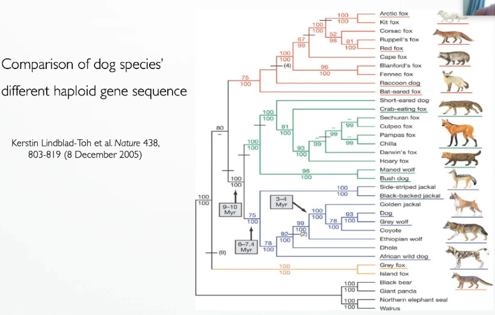

  

* 径向布局（radial layout）（可以比较好的利用空间，根节点在中心）

  * 径向树（radial tree）

    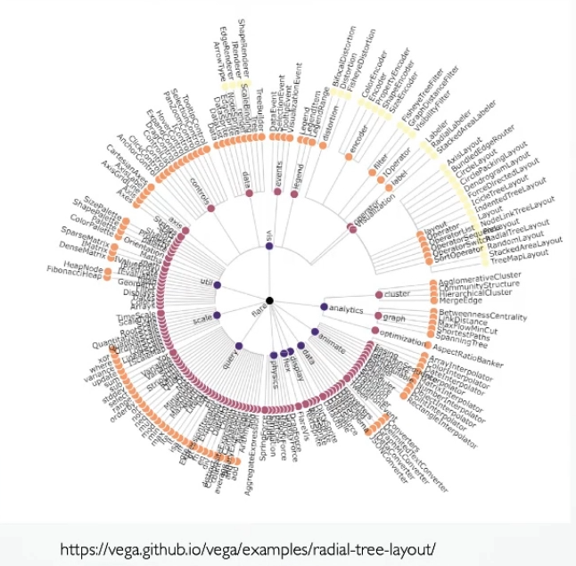

  * 锥形树（cone tree）：三维空间（顶部投影径向、侧面投影正交）

    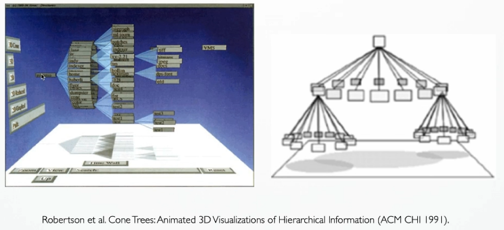

  * 混合树（hyperbolic tree）：在hyperbolic空间中放置节点

    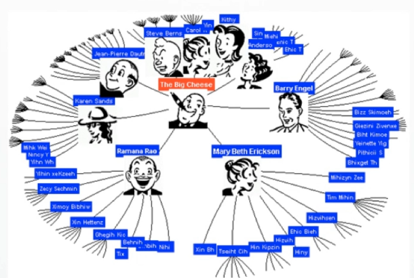

> 问题：深度越高，点越多，节点呈指数型增长；

> 解决方式：变形、过滤

* 应用

###### 1.2.2 空间填充法（space-filling methods）**：**空间高效的

* Treemap：空间利用率比节点链接法好，使用颜色和大小编码，方便用户观察权重较大的点；但结构不如节点链接直观，难以辨别深层次节点，当层次过多时深层次节点较小，交互困难。

  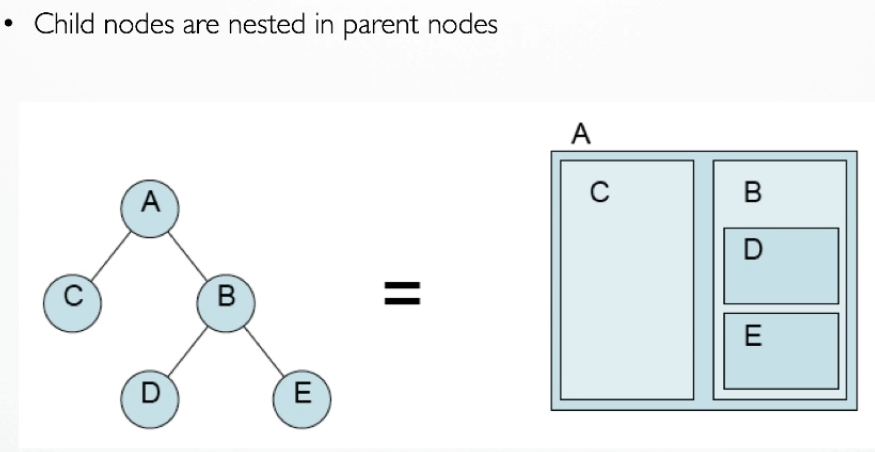

  > 假定所有的叶子节点都有大小相关的属性、父节点的大小等于所有子节点大小的和

  * slice-and-dice subdivision

  

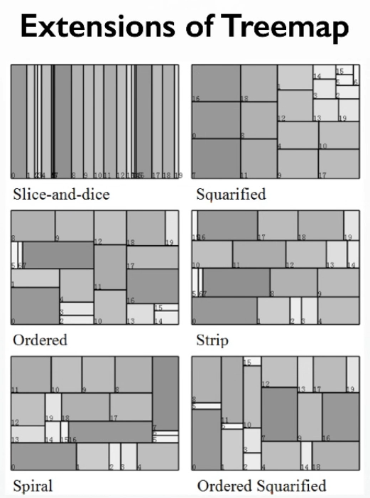

* Voronoi treemap

  * 基础：结构不规则

    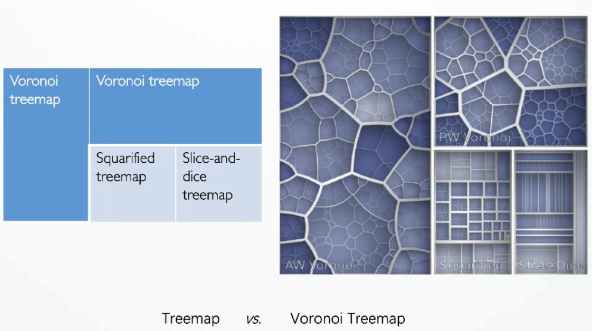

  * bubble treemap：

    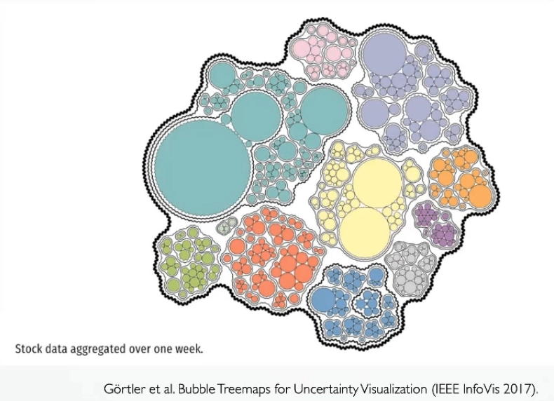

  * sunburst plot:

    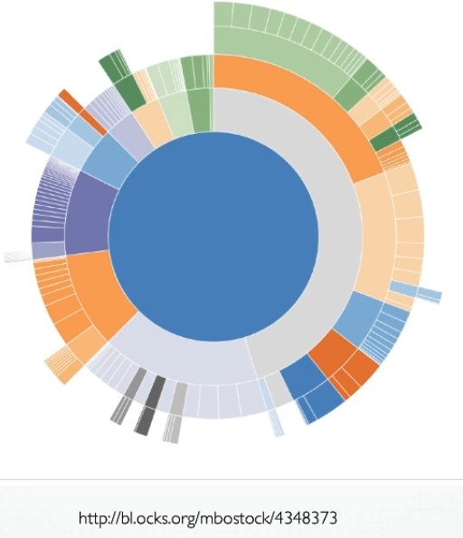

* 应用

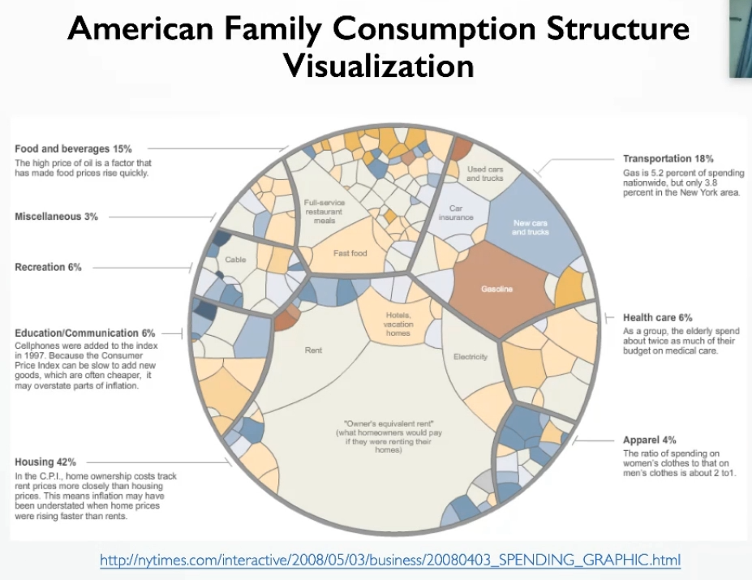

#### 2 图可视化

##### 2.1 网络数据

图的一般数据结构为网络数据（network data），网络数据有很多种，例如：

- 社交网络（social network）
- 手机网络（mobile network）
- 邮件网络（mail network）
- 合作人际网络（collaboration network）

##### 2.2 图可视化方法

* **节点链接法**（node-link diagram）

  * **力导向布局：**物理模型，边-弹簧，节点-质点，力的相互作用模仿节点之间相互作用的方法

    **模型：**spring model\energy mode

    **节点位置计算：**根据随机或初始化配置计算初始点、LOOP（计算每对点之间的相互作用力、累计每个节点的力/向量、根据力更新节点位置）

    **优势：**灵活、易于实现

    **劣势：**陷入局部最优点、初始配置很重要、计算复杂度高

  * **力导向布局扩展：**Barnes-Hut quadtree dedcomposition\ FADE \ GRIP \ FMS \ FM3 \ GVA

  * **MDS 布局：**解决力导向布局的不足，保证节点距离的一致性，是一种全局最优方法

  * **其他**：

    * 正交布局

    * 弧布局

      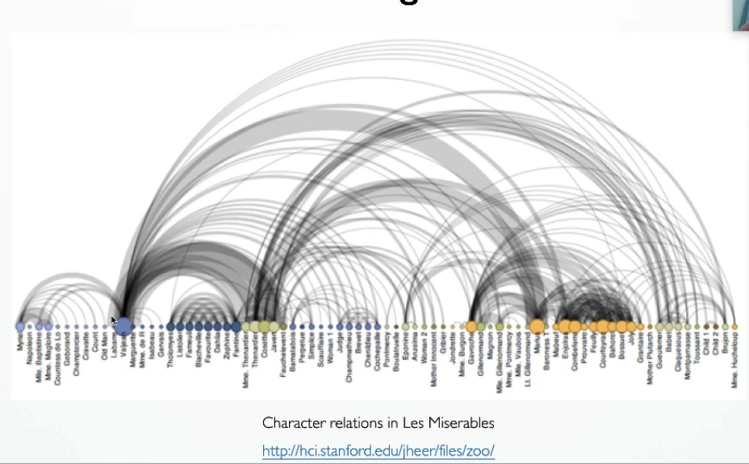

      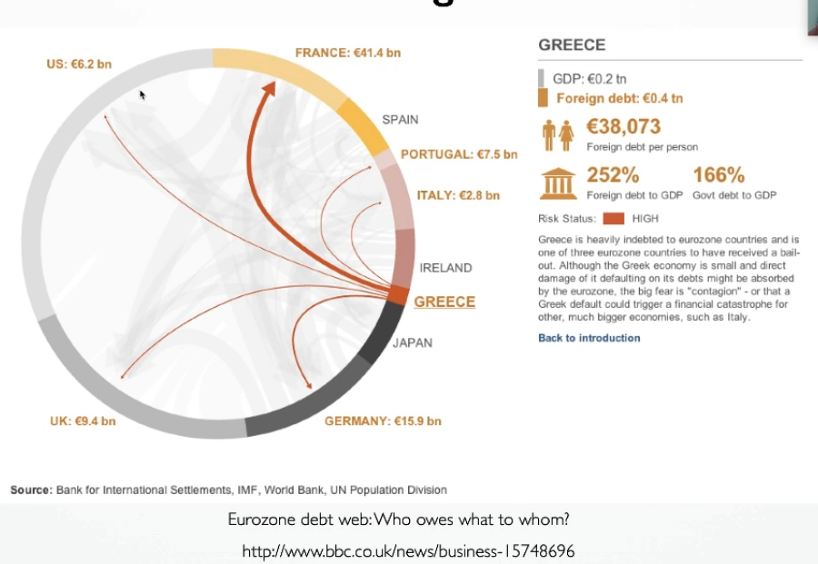

    * 环状布局

  * 总结：直观、时间复杂度高、对cluttered图不友好

    

* 邻接矩阵

  相关问题：节点排序、路经寻找

  好的节点排序：发现pattern

  识别矩阵中的pattern：

  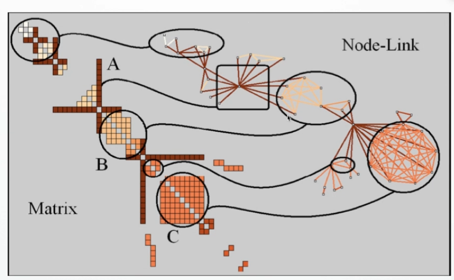

  优缺点：

  * 不会有边视觉混淆问题
  * good visual scalability
  * good presentation of graph pattern
  * 抽象、难以理解
  * 很难发现transitive relation path

  

* 其他方法

  * 基于属性的布局：基于属性值对节点进行排序

  * 混合布局
  

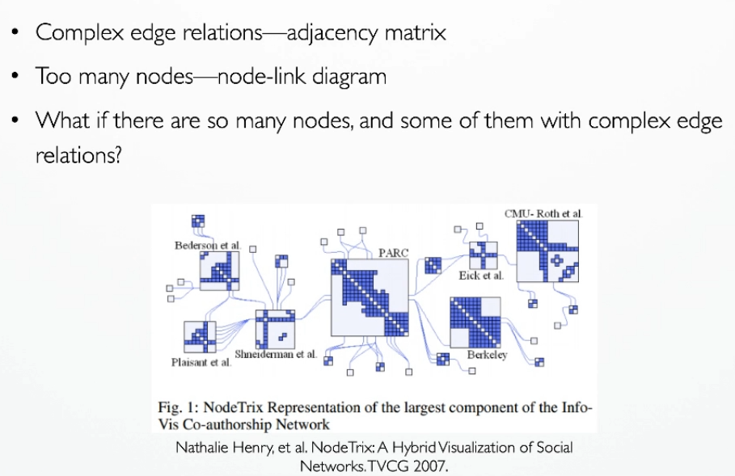

##### 2.3 图简化

* 抽取网络主题结构

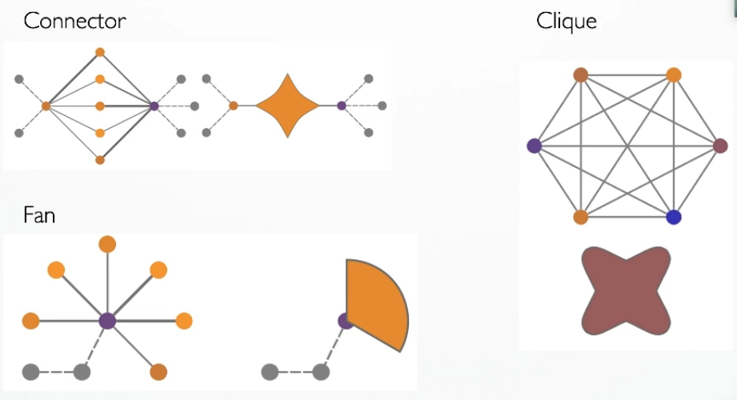

* 边绑定

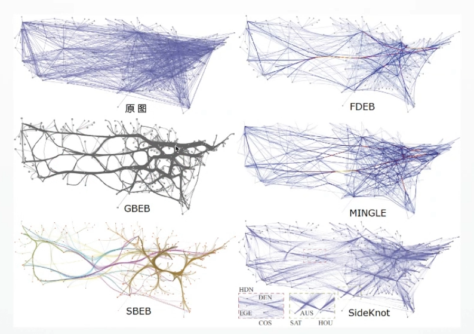

##### 2.4 可视化工具

* 可视化库
  * Alchemy.js
  * Sigma.js
  * Cytoscape.js
  * VivaGraphJS
  * D3.js
  * Pixi.js
* 可视化软件
  * gephi
  * cytoscape
  * palantir
  * visone

#### 3 总结

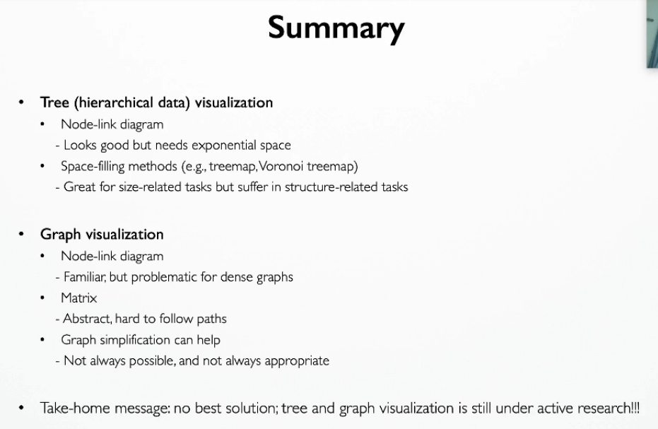

