**outline**

* 基本交互技术
* 可视化交互模型
* 任务、技术、设备
* take-away messages

#### 基本交互技术

Yi et al. 在2007年TVCG提出：

* 选择（Select）
* 探索（Explore/Navigation）
* 重配（Reconfigure）
* 编码（Encode）
* 抽象/具象（Abstract/Elaborate）
* 过滤（Filter）
* 关联（Connect）

##### **选择**

选择感兴趣的对象，具体包括：悬停（Pop-up tooltip）不要引入太复杂的计算、点选（三维中点选不如二维直接）、框选（Lasso，3维中比2维困难）

##### **探索**

经过交互显示不同的数据属性或改变数据观察视角，允许用户探索不同的数据子集、克服显示区域大小的限制，让用户主动的选择感兴趣的数据部分。例：网站链接、Z et al. MatrixWave事件序列例子、三维导航。基本操作时缩放、旋转和平移。

##### **重配**

改变数据布局，提供探索数据的新视角，有助于解释蕴含于数据中的新信息。对数据进行不同的排列，根据不同的需求，切换不同的布局，展现不同的特点，显示隐藏信息。方法：rearrange view、sorting、reposition（dust&magnet）

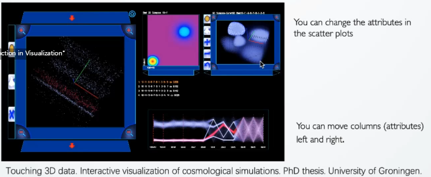

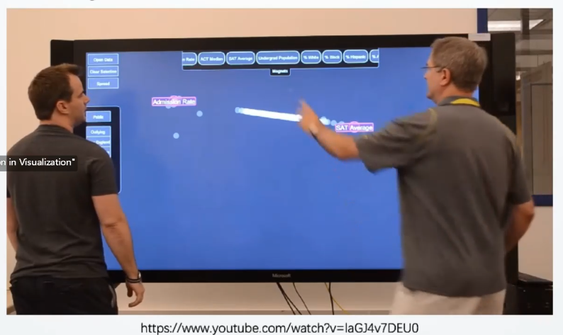

##### **编码**

用户选择不同的可视化表现方法、不同的编码方式

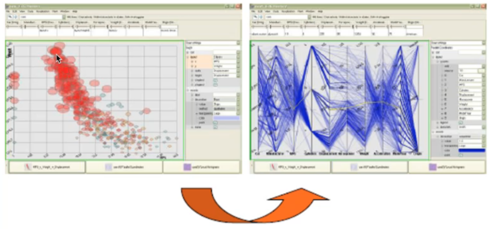

##### **抽象和具象**

先简化数据然后显示细节信息，比如地图缩放（Zooming）、折叠饼图、details-on-demand（显示全局的同时，按用户需求显示部分的细节数据）

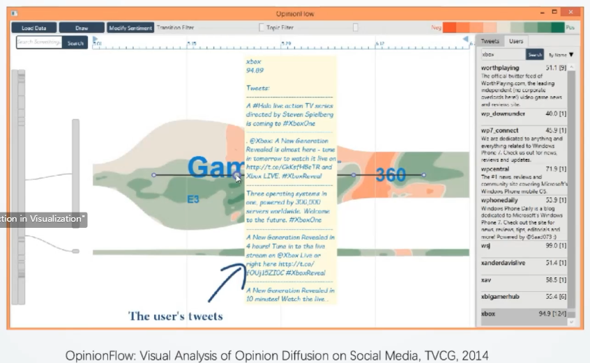

##### **过滤/限制**

用户指定数据的查找范围，帮助用户选择感兴趣的部分。比如，过滤/限制、动态查询

##### **链接**

与选择交互有密切的联系，展示相关数据，高亮关联信息，显示关联图表。

比如：Linked View(使用不同的窗口展示数据不同的属性，同一个数据在不同的的数据中显示)

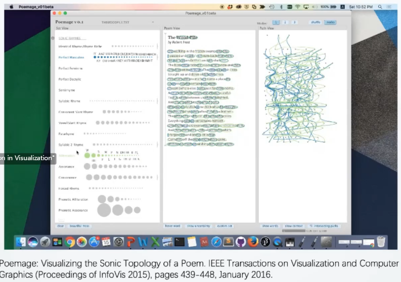

#### 可视化交互模型

##### **overview+detail**：不同的窗口

在资源有限的条件下，显示全部数据的概览以及部分细节，用户可以在概览中选择自己感兴趣的部分查看细节。

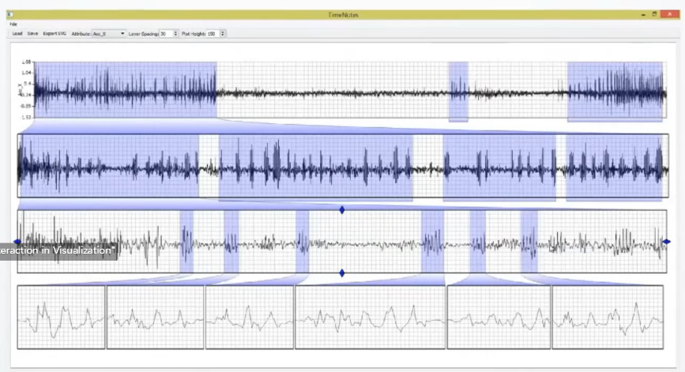

##### **focus+context**：同一个窗口

 在不失上下文信息的情况下，突出强调用户兴趣焦点部分的细节信息。

鱼眼技术：可以看到聚焦的细节，也能看到聚焦部分与上下文之间的联系

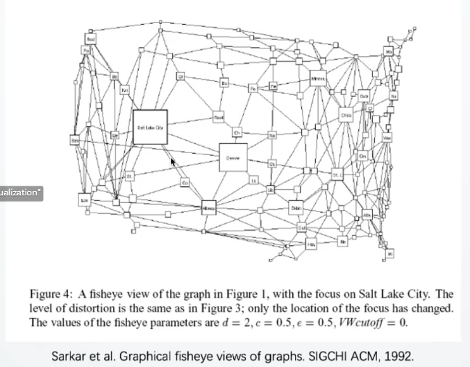

切片技术：

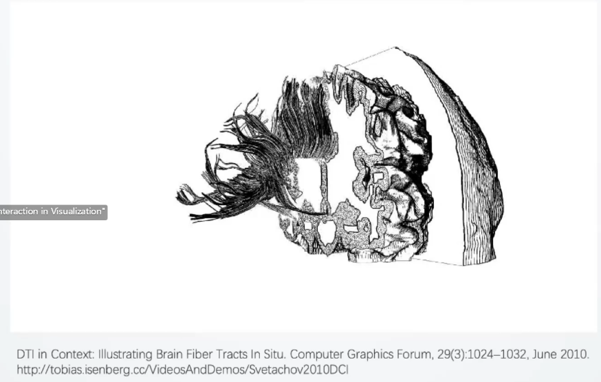

#### 任务、技术和设备

怎样通过可视化任务选择交互技术和交互设备，或者根据交互技术和交互设备来完成可视化任务。

##### **可视化交互任务**

- 视图对象操纵
- 可视化装置操纵
- 3D数据选择和注释

##### 交互技术和设备

* **触摸交互**

  * 触摸屏：

    ​	大屏（沉浸感、显示更多数据，交互不便

    ​	小屏（比如smartwatch，便利，数据呈现有限

​				竖直：适合做呈现和表述；

​				水平：适合分析和合作研究；但必定有一个人看着的是倒着的图像，旋转二维图像的方法（RNT\TNT技术）

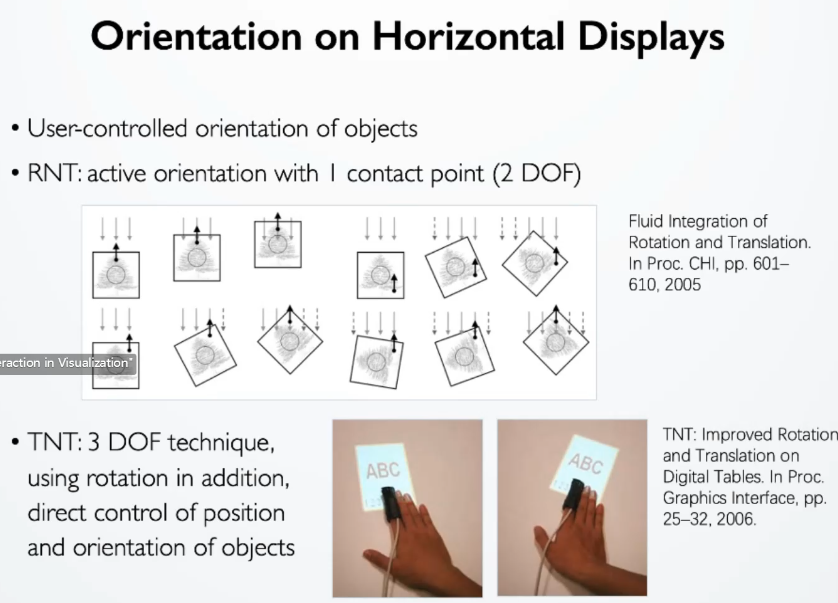

​				竖着和水平调整：适合做设计，比如建筑师画图；

​			触摸的精度问题：交互的物体有大小，比如笔、手指、拳头、手掌，胖手指问题

​			触摸屏上的手势交互：使用不同的的接触形状来控制不同的功能，比如一根/多根手指、手掌；利用边角区域进行操作

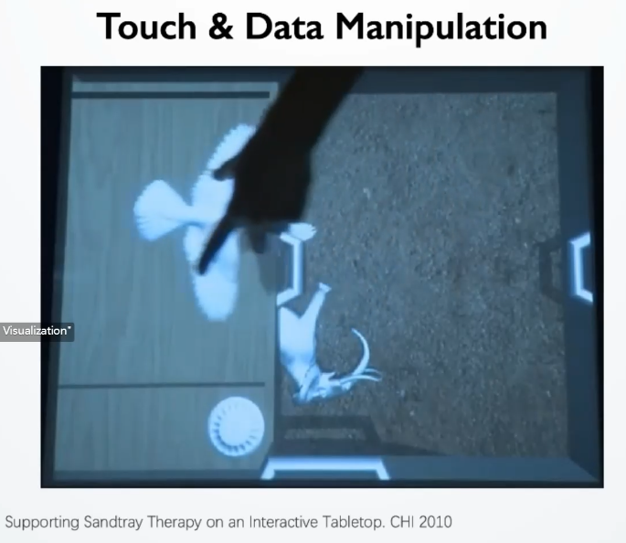

* **Mid-air 交互**（隔空交互）

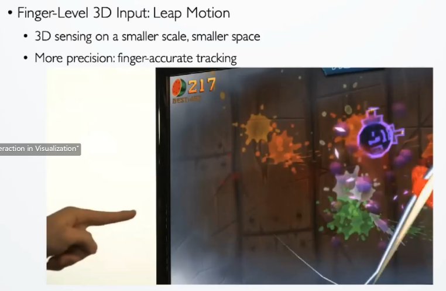

​		Leap Motion：交互发生在三维空间中，

​		Microsoft Kinect

​		在什么场景中更有意义？医学手术，VR，AR，MR

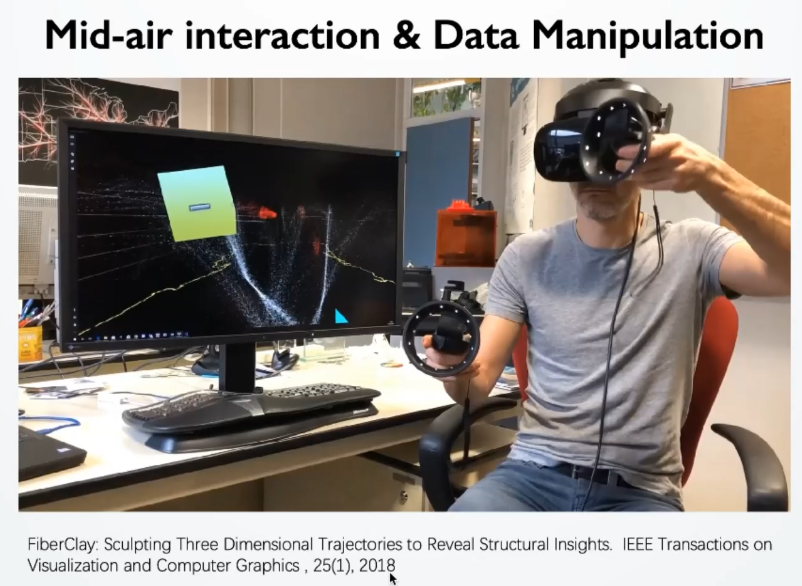

* **混合交互**
  * 压力+触摸
  * 触摸+实体交互
  * 空中手势+实体

#### TAKE-AWAY MASSAGES

- 现已有大量2D数据的交互研究，但3D数据的研究较少。
- 3D数据集有复杂的特征和结构，导致3D数据的交互更具挑战。
- 将用户的意图纳入考虑，3D交互技术会更有意义。

