#### 文本可视化释义

文本：书本、网页等都是文本

应用：社交计算、淘宝评论等

任务：分析内容、话题

针对：分析师、研究员

**文本分析的三个层级：**

- 词法分析
- 语法分析
- 语义分析

文本分类：单文档、文档集合、时序文档

文本特征：内容、结构、多层级信息

文本可视化流程：原始文本 - 文本分析和挖掘（预处理-text wranging、特征提取-关键词/词频/主题、measurement-相似度计算/聚类） - 可视化（可视设计+布局） - 交互（链接和刷选、zooming、focus+context、filtering）

#### 文本分析技术

- ##### 分词 tokenization

  - 移除停用词
  - 复数形式变为单数
  - 分为一个个单词

- ##### 文本向量化模型

  - bag-of-words（很难反映语义上的相似度）

    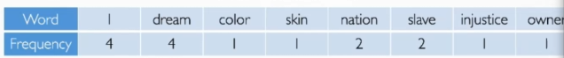

  - TF-IDF

  - document similarity：计算两个词频向量间的相似性

- ##### 主题提取

  - Latent Semantic Indexing
  - pLSI
  - LDA

#### 文本可视化方法

- 基于特征分类：
  - 文本内容
  - 文本关系
  - 多层次文本分析

##### **文本内容可视化**

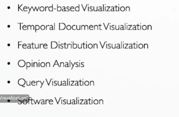

* ###### keyword-based

  * 词云：tag cloud / word cloud\wordles

    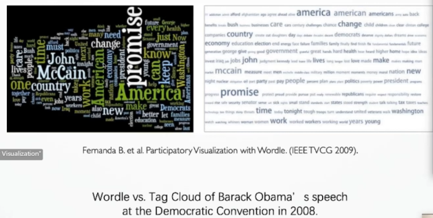

    ​	**词云的布局方式：**

    * Spiral layout

      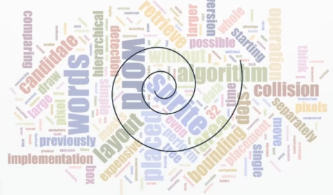

    * 水平和垂直布局

    * 形状布局

    **词云的争议：**展示的信息有限、词频有时不代表什么、布局随机（没办法比较追踪 2020 pacificvis/ EdWordle保证词的位置相对稳定

  * DocuBurst：针对文本和层级信息；缺点 - 旋转使词的识别困难、扇形面积较小导致重叠

    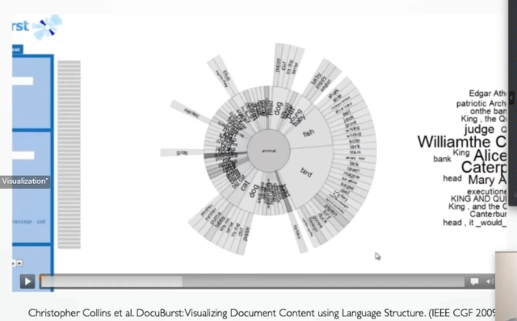

  * Document Card

    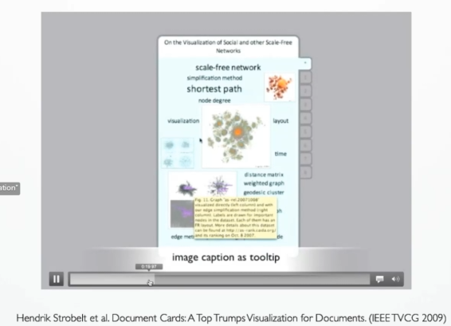

* ###### temporal document visualization：推特数据、新闻

  * Morphable Word Cloud

    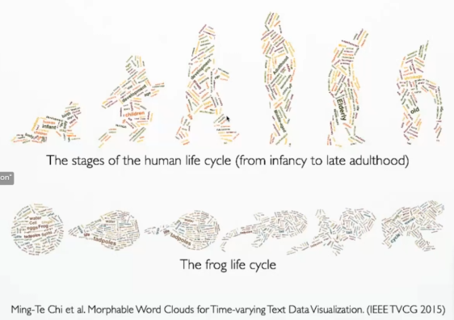

  * 主题河流图

    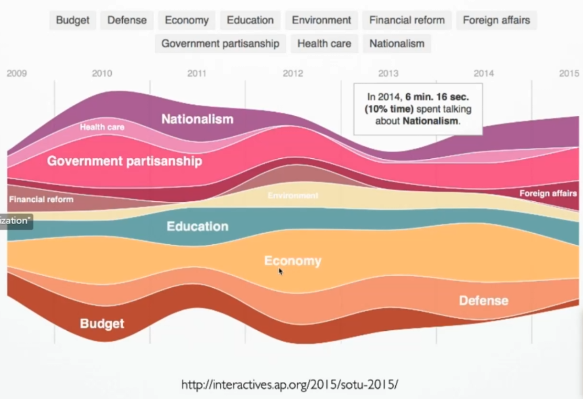

  * TextFlow：展示话题的聚合和拆分、关键词流向和热度

    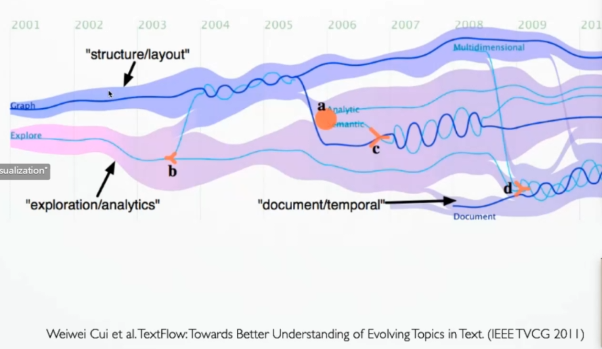

  * TIARA：与河流图的区别-词云，

    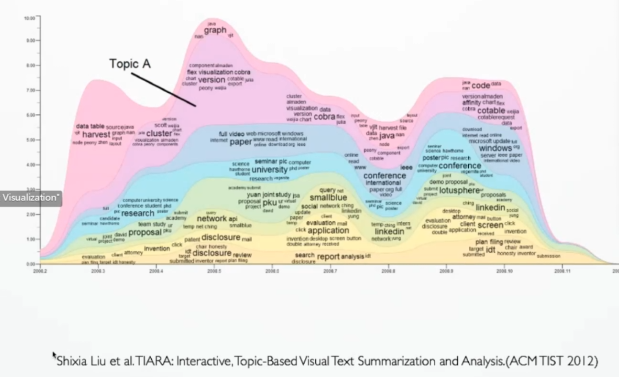

  * history flow：

    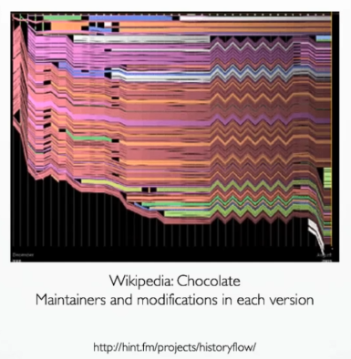

  * topic competition on social media：话题之间的竞争

    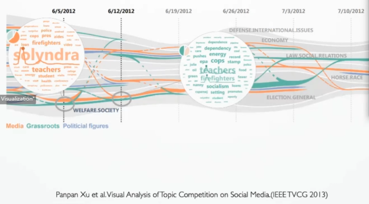

* ###### feature distribution visualization

  * ConceptVector：针对有歧义的词的向量

    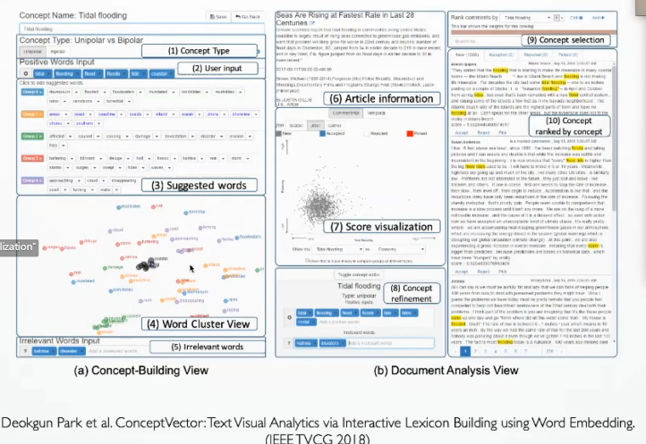

  * Senten Tree

    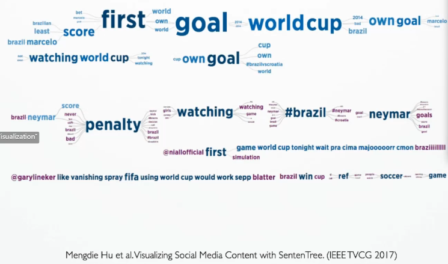

  * TextArc

    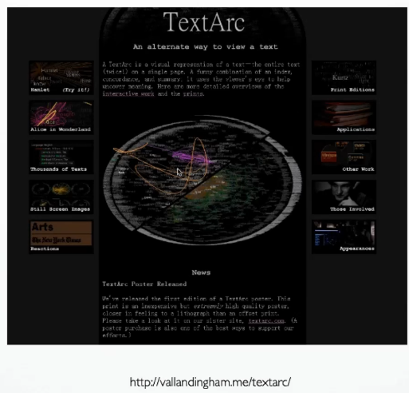

  * Literature Fingerprinting

    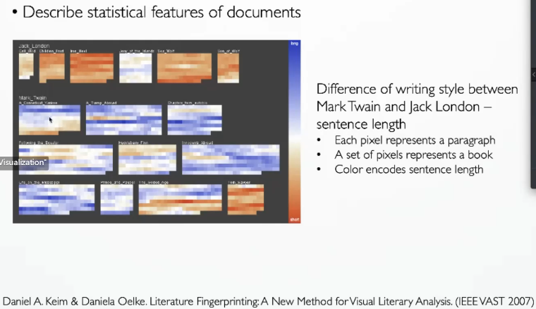

  *  FeatureLens

    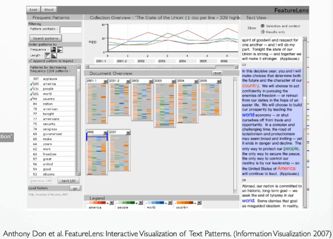

* ###### opinion analysis

  * Emotional arcs for inaugural addresses

    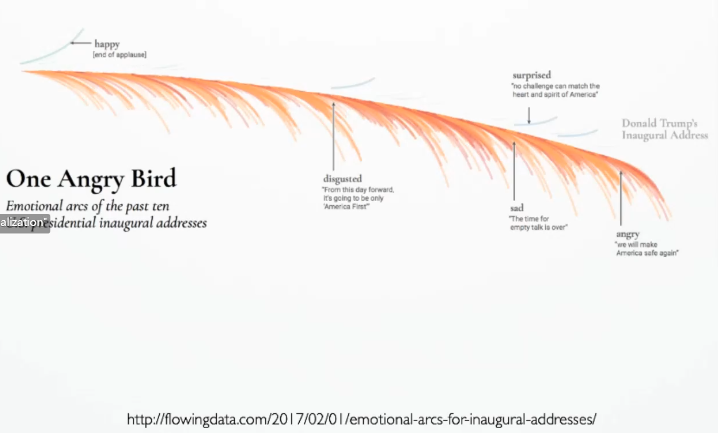

  * Matrix-based Customer Feedback Visualization

    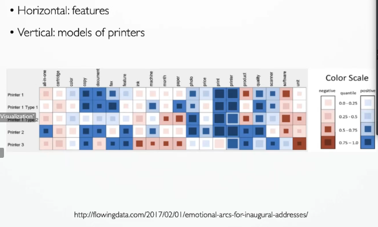

  * Opinions in News

    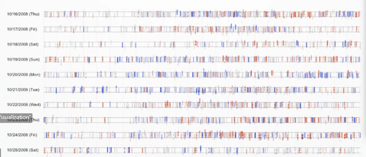

  * SocialHelix

    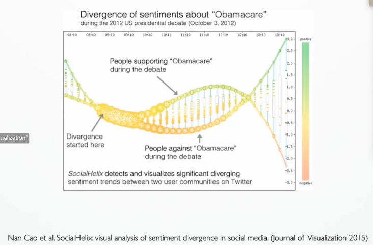

* ###### Query visualization

  * TileBar

    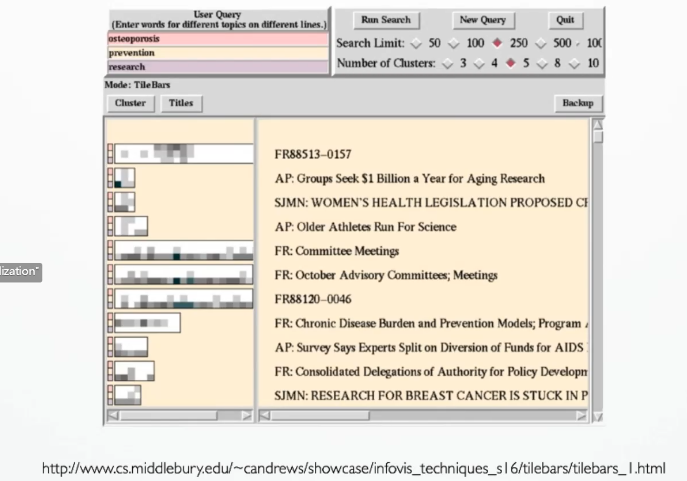

  * Sparkler

    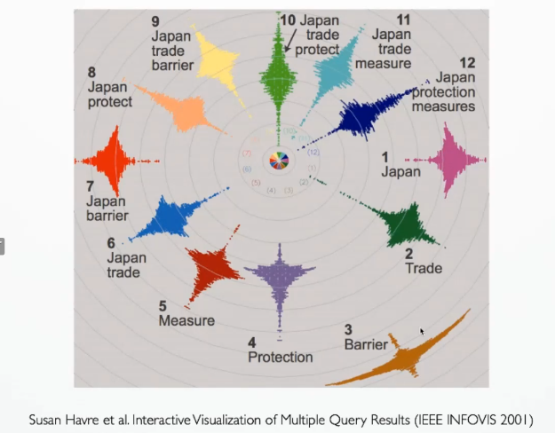

  * Monadic Exploration

    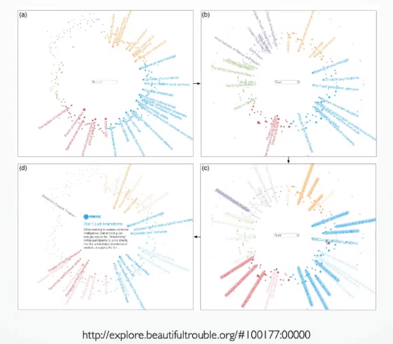

* ###### Software visualization

  * SeeSoft

    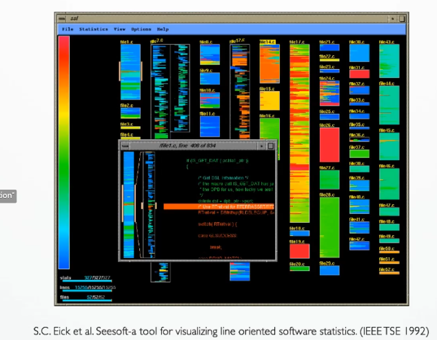

  * CodeSwarm

    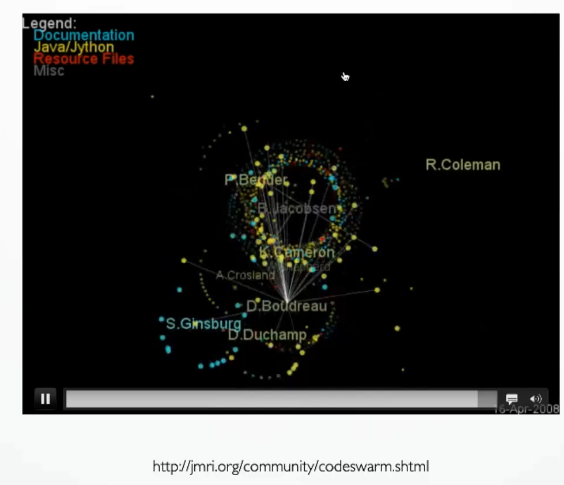

##### **文本关系可视化**

文本中的关系：引用、超链接、相似性和层级关系

方法：树和图可视化

 * wordnet：文本前缀树

   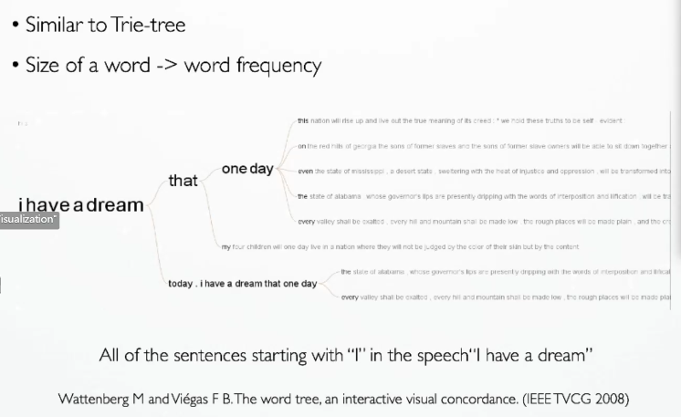

 * PhraseNet：知识图谱

   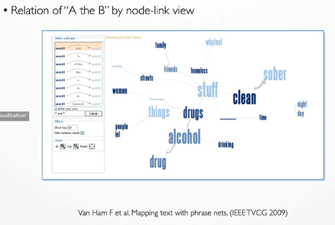

 * NewsMap：树图

   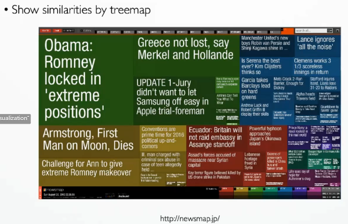

 * GalaxyView

   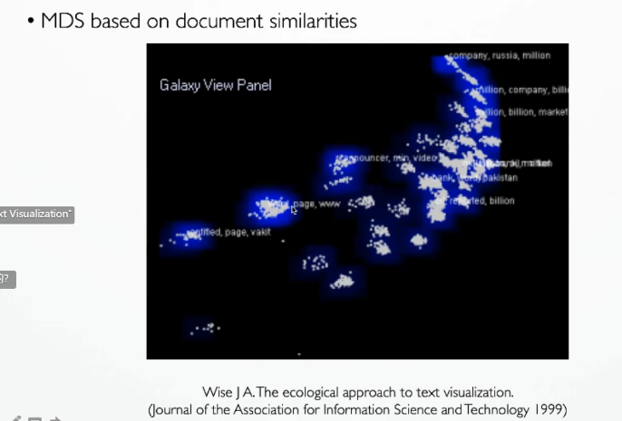

 * ThemeScape

   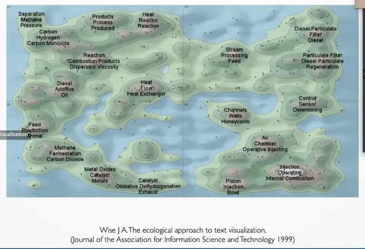

 * SOM Projection

   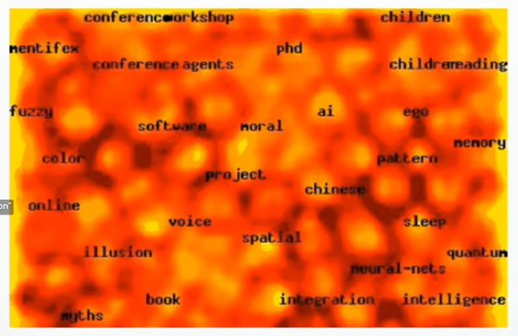

 * Jigsaw

   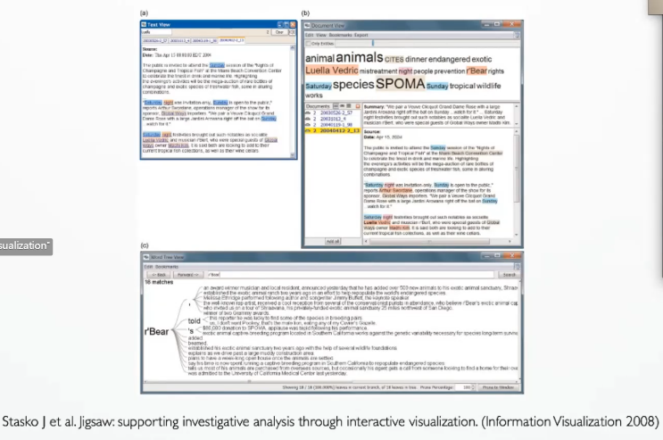

##### **multi-level document visualization**

* facetAtlas

  

* 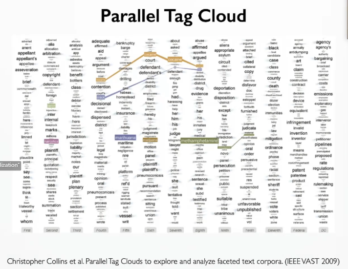

#### 多媒体可视化

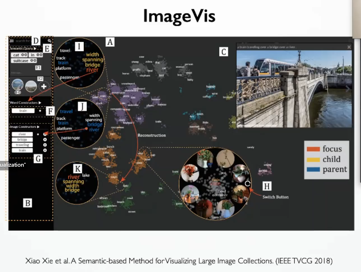