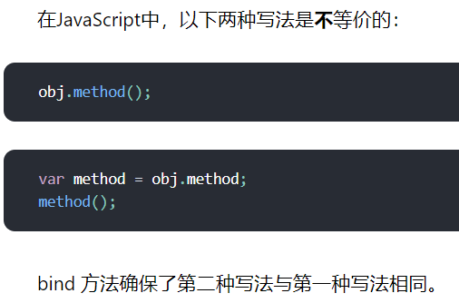

确保函数可以访问的组件属性

<!--more-->

目的：确保函数可以访问的组件属性，比如this.props/this.state

1 构造函数中：

 

```javascript
this.handleClick = this.handleClick.bind(this);

——

return <button onClick={this.handleClick}>Click Me</button>;
```

2 class 属性

```javascript
handleClick = () => {
   console.log('Click happened');
  };

return <button onClick={this.handleClick}>Click Me</button>;
```

3 render中绑定 

使用 Function.prototype.bind 会在每次组件渲染时创建一个新的函数

```javascript
 handleClick() {
   console.log('Click happened');
  }
  render() {
   return <button onClick={this.handleClick.bind(this)}>Click Me</button>;
  }
```

4 箭头函数

会在每次组件渲染时创建一个新的函数

```javascript
return <button onClick={() => this.handleClick()}>Click Me</button>;
```

为什么要绑定：

 

> 使用 React，通常只需要绑定*传递*给其他组件的方法。例如，<button onClick={this.handleClick}> 是在传递 this.handleClick ，所以需要绑定它。但是，没有必要绑定 render 方法或生命周期方法：我们并没有将它们传递给其他的组件。

？？？？？？？？？？？？？

https://zh-hans.reactjs.org/docs/faq-functions.html#why-is-binding-necessary-at-all