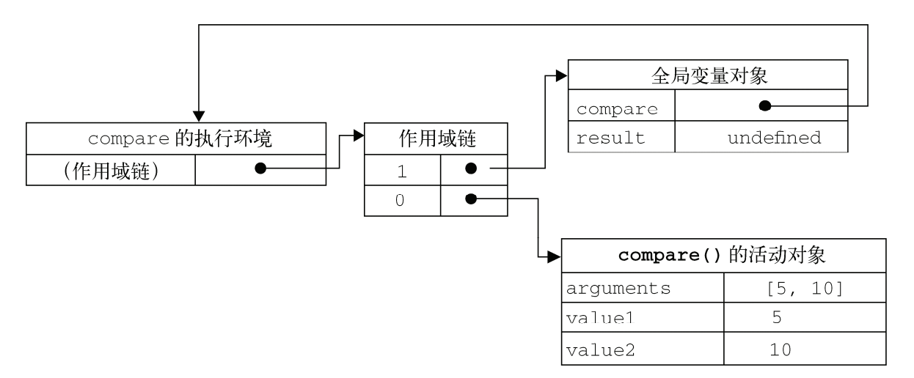
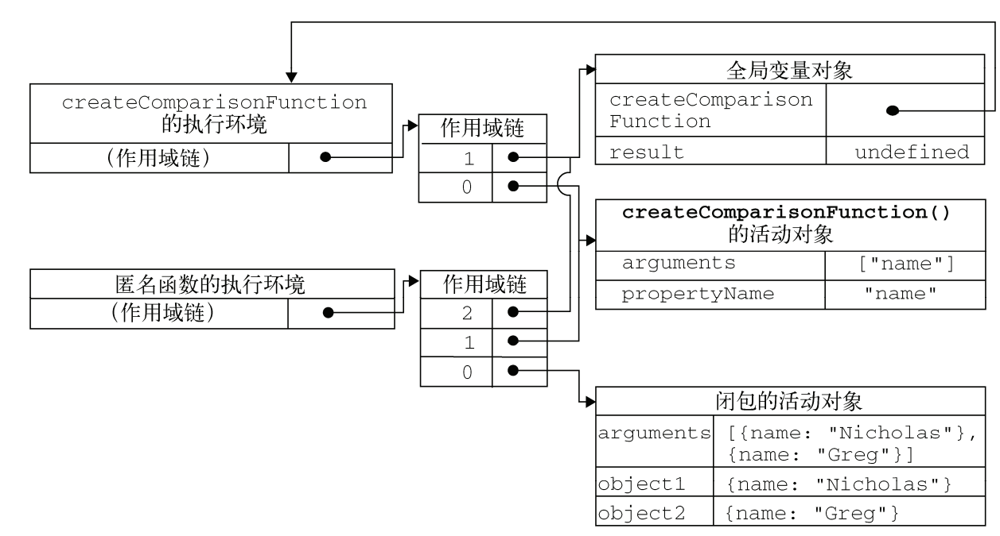

<!--more-->

### 1、闭包的定义

> 有权访问另一个函数作用域中的变量的函数

### 2、创建闭包的方式

> 在一个函数内创建另一个函数

```javascript
function createComparisonFunction(propertyName){
  
    return function(object1, object2){  // 返回一个匿名函数,该匿名函数可以访问createComparisonFunction函数作用域中的propertyName变量
        var value1 = object1[propertyName];
        var value2 = object2[propertyName];
        
        if(value1 < value2){
            return -1;
        }else if(value1 > value2){
            return 1;
        }else{
            return 0;
        }
    };
}
```

### 3、理解闭包

#### 3.1、为什么内部函数可以访问外部函数变量？

> 内部函数作用域链中包含外部函数的作用域

##### 3.1.1、执行环境、作用域链、活动对象：

* **创建：**
  * 当某个函数**被调用时**，会创建该函数的**执行环境**及相应的**作用域链**，然后使用arguments和其它名命参数的值来初始化函数的**活动对象**。
  * 执行流进入一个函数时，函数环境被推入一个**环境栈**中；执行完毕，栈将其环境弹出，返回上一个执行环境。
* **标识符解析：**沿作用域链逐级向后回溯搜索标识符。
* **初始化：**
  * 函数创建时：创建包含全局变量对象的作用域链，保存在[[Scope]]属性中；
  * 函数调用时：
    1. 创建执行环境；
    2. 赋值函数的[[Scope]]属性中的对象构建作用域链；
    3. 创建活动对象，推入作用域链前端。（P.S.作用域链本质是一个指向变量对象的指针列表）

* **生命周期：**
  * 全局环境的变量对象始终存在，局部环境的变量对象只在函数执行的过程中存在。
  * 当某个执行环境中的所有代码执行完，该环境和保存在其中的变量和函数定义被销毁，



##### 3.1.2、闭包的作用域链、执行环境、活动对象：

* **闭包函数会将外部函数的活动对象添加到它的作用域链中**。
  * e.g：匿名函数被返回时，作用域链被初始化为包含外部函数的活动对象和全局变量对象。（调用时推入自己的活动对象？）
* **生命周期：**
  * 外部函数返回：外部函数执行环境被销毁（执行环境栈），但其作活动对象仍然留在内存中；（因为匿名函数的作用域链仍然引用者这个活动对象）
  * 直到**匿名函数被销毁，包围函数（外部函数）的活动对象才被销毁**；（通过设置变量=null，解除对匿名函数的引用，通知垃圾回收例程将其清除）



#### 3.2、闭包与变量

闭包作用域链中保存的是外部函数的变量**对象**，而不是某一时刻具体的变量值，所以以下示例每个函数返回的都是0：

> 每个函数都引用着保存变量i的同一个对象，当createFunction返回后变量i为10

```javascript
function createFunction(){
    var result = [];
    for(var i = 0; i < 10; ++i){
        result[i] = function(){
            return i;
        } 
    }
    return result;
}

var functions = createFunction();

console.log(functions[4]());    // 10
```

```javascript
// 通过创建另一个匿名函数让闭包的行为符合预期
function createFunction(){
    var result = [];
    for(var i = 0; i < 10; ++i){
        result[i] = function(num){
            return function(){
                return num;
            }
        }(i);	、、 立即执行
    }
    return result;
}

var functions = createFunction();

console.log(functions[4]());    // 4
```

#### 3.3、闭包与this

> 函数**被调用时**，自动取得两个特殊变量：this和arguments。
>
> **this对象是在运行时基于函数的执行环境绑定的**。
>
> **——匿名函数的执行环境具有全局性，通常指向window。**

```javascript
var name = 'in window';

var objectRegular = {
    name: 'in object',
    getName: function(){
        return this.name;
    }
}

var objectSpe = {
    name: 'in object',
    getNameFunc: function(){
        return function(){
            return this.name;
        }
    }
}

var objectSpe2 = {
    name: 'in object',
    getNameFunc: function(){
        var that = this;    // 把外部作用域中的this保存在闭包能够访问的变量中
        return function(){
            return that.name;
        }
    }
}

console.log(objectRegular.getName());   // in object
console.log((objectRegular.getName)());   // in object
console.log((objectRegular.getName = objectRegular.getName)());   // in window

console.log(objectSpe.getNameFunc()()); // in window
console.log(objectSpe2.getNameFunc()()); // in object

console.log(this.name); // in window
```

### 4、示例理解

```javascript
inner = 'window';

function say(){
    console.log(inner);
    console.log(this.inner);
}

var obj1 = (function() {
    var inner = '1-1';
    return {
        inner: '1-2',
        say: function() {
            console.log(inner);
            console.log(this.inner);
        }
    }
})();

var obj2 = (function() {
    var inner = '2-1';
    return {
        inner: '2-2',
        say: function() {
            console.log(inner);
            console.log(this.inner);
        }
    }
})();

say();	// window window

obj1.say();		// 1-1 1-2
obj2.say();		// 2-1 2-2
 
obj1.say = say;	
obj1.say();		// window 1-2

obj1.say = obj2.say;	
obj1.say();		// 2-1 1-2
```

